Okay, let's delve into each of these topics to provide a comprehensive understanding of Service-Oriented Architecture, Web Services, and cloud computing concepts.

## Introduction to Service-Oriented Architecture (SOA)

Service-Oriented Architecture (SOA) is an architectural style that focuses on the development of highly interoperable and flexible systems. It achieves this by structuring applications as collections of loosely coupled, discoverable services. Each service encapsulates a specific business function and can be accessed and reused by other applications, regardless of their underlying technology or platform.

**Key Principles of SOA:**

* **Loose Coupling:** Services are designed to have minimal dependencies on each other. This means that changes to one service should not significantly impact other services that consume it. This promotes flexibility and reduces the risk of cascading failures.
* **Reusability:** Services are designed to be reusable components that can be leveraged in multiple applications and business processes. This reduces development time and costs.
* **Interoperability:** SOA promotes the ability of services to interact with each other, regardless of the programming languages, operating systems, or platforms they are built on. This is typically achieved through the use of open standards.
* **Abstraction:** Users of a service don't need to know the internal implementation details of the service. They only need to understand the service contract, which defines its functionality, inputs, and outputs.
* **Discoverability:** Services are designed to be discoverable, meaning that potential consumers can find and understand the available services and their capabilities.
* **Composability:** Services can be combined or orchestrated to create new, more complex business processes and applications.
* **Statelessness (Ideally):** Services should ideally be stateless, meaning they do not retain information about past interactions. Each request is treated independently. This improves scalability and reliability.

**Benefits of SOA:**

* **Increased Agility:** Businesses can respond more quickly to changing market conditions by rearranging and reusing existing services to create new applications and processes.
* **Improved Interoperability:** SOA facilitates seamless communication and data exchange between disparate systems within an organization and with external partners.
* **Enhanced Reusability:** Reusing services across multiple applications reduces development effort, time, and cost.
* **Easier Maintenance and Updates:** Loosely coupled services are easier to maintain and update independently without affecting the entire system.
* **Better Business-IT Alignment:** SOA helps align IT capabilities more closely with business needs by breaking down monolithic applications into smaller, business-aligned services.

**Suitable Image/Graph:** A diagram illustrating the concept of loose coupling with multiple services interacting through a common bus or middleware layer.

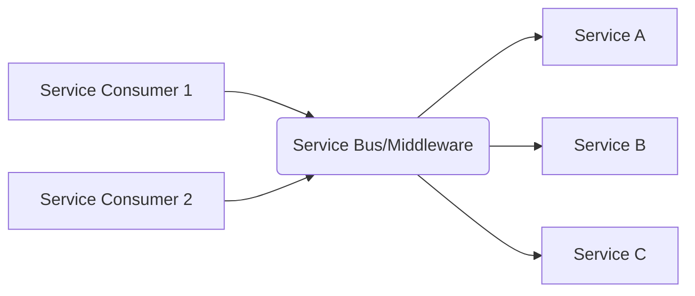
*Figure 1: Basic SOA Concept with a Service Bus*

## Web Services

Web Services are a specific implementation of the SOA concept, using open web standards to enable communication and data exchange between applications over the internet. They are self-contained, modular applications that can be described, published, located, and invoked over the web.

**Role within SOA:** Web services serve as the building blocks of an SOA. They are the actual services that expose business functionality and adhere to the principles of SOA, such as loose coupling and interoperability.

**Fundamental Concepts:**

* **Messaging:** Web services communicate by exchanging messages, typically in XML format.
* **Standards:** They rely on a set of open standards for defining, publishing, and interacting with services.
* **Transport:** Web services typically use standard internet protocols like HTTP for message transport.

**Suitable Image/Graph:** A simple diagram showing two applications exchanging messages over the internet using web services.

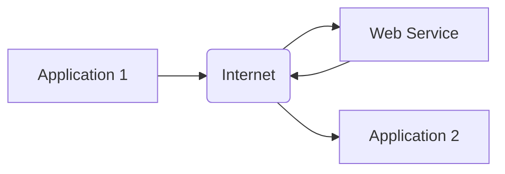
*Figure 2: Basic Web Service Communication*

## Basic Web Services Architecture

The basic architecture of web services involves three key roles and three key operations:

* **Roles:**
    * **Service Provider:** The entity that implements and provides the web service.
    * **Service Requester (Consumer):** The entity that needs to use a web service.
    * **Service Broker (Registry):** A directory where service providers can publish their service descriptions and service requesters can discover services.

* **Operations:**
    * **Publish:** The service provider publishes the service description to the service broker.
    * **Find:** The service requester queries the service broker to find a service that meets its requirements.
    * **Bind:** The service requester uses the information from the service description to bind to (invoke) the service provided by the service provider.

**Suitable Image/Graph:** A diagram illustrating the three roles and their interactions (publish, find, bind).

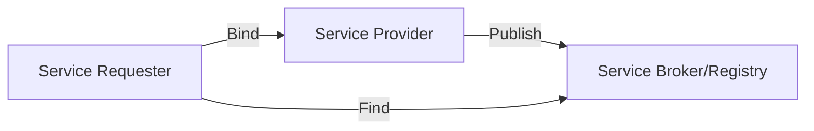
*Figure 3: Basic Web Services Architecture Roles and Operations*

## Introduction to SOAP, WSDL, and UDDI

These are core standards that were historically central to building and deploying traditional web services:

* **SOAP (Simple Object Access Protocol):**
    * **Definition:** SOAP is an XML-based messaging protocol for exchanging structured information in the implementation of web services. It defines a standard way to structure messages, including an envelope, header (optional), and body.
    * **Purpose:** It provides a platform-independent and language-independent way for applications to communicate.
    * **How it works:** SOAP messages are typically sent over HTTP, but other protocols like SMTP can also be used. The message body contains the actual data being exchanged, which can be a request to a service or a response from a service.

* **WSDL (Web Services Description Language):**
    * **Definition:** WSDL is an XML-based language used to describe the capabilities of a web service. It acts as a contract between the service provider and the service requester.
    * **Purpose:** It describes what the web service does, how to access it, the data formats it understands, and the protocols it supports.
    * **How it works:** A WSDL document defines the service endpoint (URL), the operations (methods) the service provides, the input and output parameters for each operation, and the data types used.

* **UDDI (Universal Description, Discovery, and Integration):**
    * **Definition:** UDDI is a platform-independent, XML-based registry for businesses worldwide to list themselves on the internet and discover each other. While less prevalent now, it was designed as a directory for web services.
    * **Purpose:** To enable businesses to discover and locate web services programmatically.
    * **How it works:** Service providers could publish their WSDL descriptions to a UDDI registry. Service requesters could then search the registry based on various criteria (e.g., business name, service type) to find the WSDL for a desired service and learn how to interact with it.

**How they work together:**

Historically, the typical flow for using a traditional web service involved these steps:

1.  The **Service Provider** creates a **WSDL** document describing their service.
2.  The **Service Provider** publishes the **WSDL** to a **UDDI** registry.
3.  The **Service Requester** queries the **UDDI** registry to find the desired service's **WSDL**.
4.  The **Service Requester** uses the information in the **WSDL** to understand how to construct a **SOAP** message to invoke the service.
5.  The **Service Requester** sends the **SOAP** message to the **Service Provider** over a transport protocol like HTTP.
6.  The **Service Provider** processes the **SOAP** request and sends a **SOAP** response back to the **Service Requester**.

**Suitable Image/Graph:** A diagram illustrating the interaction between a service provider, service requester, and a UDDI registry, showing the flow of WSDL and SOAP messages.

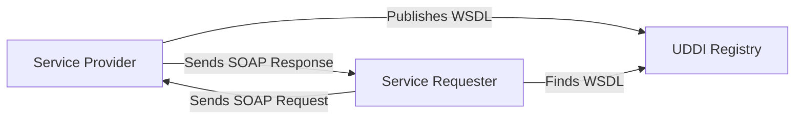
*Figure 4: Interaction of SOAP, WSDL, and UDDI*

## RESTful Services

REST (Representational State Transfer) is an architectural style that uses a set of constraints for designing networked applications. RESTful services are web services that adhere to the principles of REST. They are often considered a simpler and more lightweight alternative to traditional SOAP-based web services.

**Definition:** RESTful services are based on the concept of resources, which are identified by URIs (Uniform Resource Identifiers). Clients interact with these resources using standard HTTP methods to perform actions on them.

**Characteristics:**

* **Client-Server:** A clear separation of concerns between the client and the server.
* **Stateless:** The server does not store any client state between requests. Each request from the client must contain all the information necessary to understand and process the request.
* **Cacheable:** Responses can be cached by the client or intermediaries to improve performance.
* **Layered System:** Clients cannot ordinarily tell whether they are connected directly to the end server, or to an intermediary like a proxy or load balancer.
* **Uniform Interface:** A set of constraints that simplify the overall system architecture and improve visibility and independent evolution. This includes:
    * **Identification of resources:** Resources are identified by URIs.
    * **Manipulation of resources through representations:** Clients interact with resources by exchanging representations of the resources (e.g., JSON, XML).
    * **Self-descriptive messages:** Messages contain enough information for the recipient to understand how to process them.
    * **Hypermedia as the Engine of Application State (HATEOAS):** The client interacts with the application entirely through hypermedia provided dynamically by application servers. (This is an ideal constraint and not always strictly followed in all "RESTful" APIs).

**Components:**

* **Resources:** The key abstractions of information in a RESTful system, identified by URIs.
* **URIs:** Used to uniquely identify resources.
* **Representations:** The data format used to represent a resource (e.g., JSON, XML, HTML).
* **HTTP Methods:** Standard verbs used to perform actions on resources (GET, POST, PUT, DELETE, PATCH).
* **Stateless Communication:** Each request is independent.

**Types (Common HTTP Methods used for actions):**

* **GET:** Retrieves a representation of a resource. Should be safe and idempotent.
* **POST:** Creates a new resource or submits data to be processed.
* **PUT:** Updates an existing resource or creates a new resource if it doesn't exist at the specified URI. Should be idempotent.
* **DELETE:** Deletes a resource. Should be idempotent.
* **PATCH:** Applies partial modifications to a resource.

**Suitable Image/Graph:** A diagram showing a client interacting with resources on a server using HTTP methods.

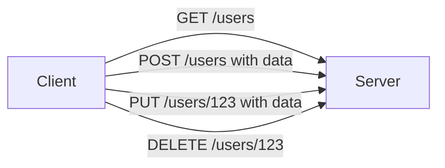
*Figure 5: RESTful Service Interaction with HTTP Methods*

## Software as a Service (SaaS)

Software as a Service (SaaS) is a cloud computing service model where a third-party provider hosts applications and makes them available to customers over the internet on a subscription basis. Users access the software through a web browser or a thin client, without needing to install, manage, or update the software or the underlying infrastructure.

**Definition:** Delivery of software applications over the internet on a subscription model.

**Characteristics:**

* **Subscription-based pricing:** Users pay a recurring fee (e.g., monthly or annually) to access the software.
* **Web accessibility:** Access to the software is typically via a web browser from anywhere with an internet connection.
* **Centralized management:** The provider manages the software, including updates, maintenance, and security.
* **Multi-tenancy:** A single instance of the application serves multiple customers, with data and configurations isolated for each tenant.
* **No infrastructure management for the user:** The user doesn't need to worry about servers, operating systems, or software installation.

**Examples:**

* Email services (e.g., Gmail, Outlook 365)
* CRM systems (e.g., Salesforce)
* Office productivity suites (e.g., Google Workspace, Microsoft 365)
* Collaboration tools (e.g., Slack, Zoom)

**Suitable Image/Graph:** A diagram showing multiple users accessing a single software application hosted in the cloud via the internet.

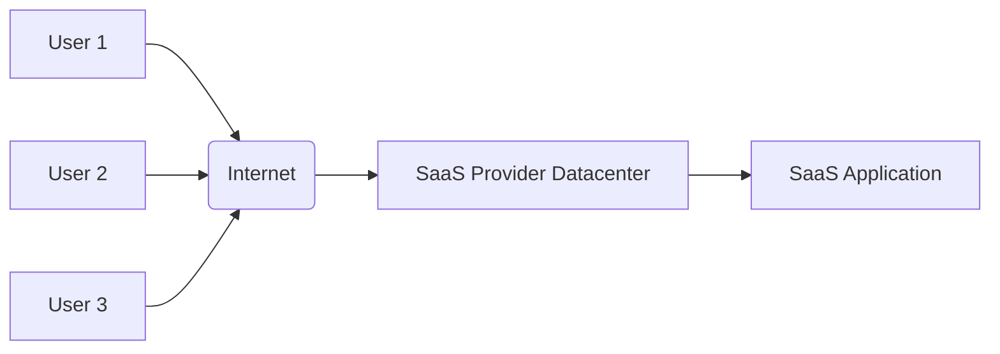
*Figure 6: Software as a Service (SaaS) Model*

## Platform as a Service (PaaS)

Platform as a Service (PaaS) is a cloud computing service model that provides a platform and environment for developers to build, deploy, and manage applications without the complexity of building and maintaining the underlying infrastructure. The provider offers the operating system, databases, middleware, development tools, and other services needed for application development and deployment.

**Definition:** Provides a platform for building and deploying applications, including the necessary software and infrastructure.

**Characteristics:**

* **Development and deployment environment:** Offers tools and services for the entire application lifecycle.
* **Abstraction of infrastructure:** Users don't manage the underlying servers, storage, or networking.
* **Middleware and database services:** Includes pre-configured middleware, databases, and other components.
* **Scalability:** The platform can typically scale automatically based on application demand.
* **Collaboration features:** Often includes tools for team collaboration during development.

**Examples:**

* Google App Engine
* Heroku
* Microsoft Azure App Service
* AWS Elastic Beanstalk

**Suitable Image/Graph:** A diagram showing developers deploying applications onto a platform provided by the cloud provider, which sits above the infrastructure layer.

```mermaid
graph LR
    A[Developer 1] --> D(PaaS Platform)
    B[Developer 2] --> D
    D --> E[Operating System, Middleware, Databases]
    E --> F[Infrastructure (Servers, Storage, Networking)]
```
*Figure 7: Platform as a Service (PaaS) Model*

## Organizational Scenarios of Clouds

Cloud computing offers various deployment models and service models that cater to different organizational needs and scenarios:

* **Public Cloud:**
    * **Scenario:** Organizations that need scalable, cost-effective, and easily accessible computing resources for applications that don't require strict data sovereignty or highly customized environments. Examples include web applications, data analytics, and general-purpose computing.
    * **Description:** Resources are owned and operated by a third-party cloud provider and shared among multiple tenants over the public internet.

* **Private Cloud:**
    * **Scenario:** Organizations with strict security, compliance, or performance requirements, or those that need greater control over their infrastructure. Examples include government agencies, financial institutions, or companies handling sensitive data.
    * **Description:** Cloud infrastructure is dedicated to a single organization, which can be managed internally or by a third party. It can be located on-premises or off-premises.

* **Hybrid Cloud:**
    * **Scenario:** Organizations that need to leverage the benefits of both public and private clouds. This is common for organizations migrating to the cloud gradually, or those with workloads that have varying requirements (some sensitive, some less so). Examples include using the public cloud for burstable capacity or disaster recovery while keeping sensitive data on-premises.
    * **Description:** A combination of two or more distinct cloud infrastructures (private, public, or community) that remain unique entities but are bound together by standardized or proprietary technology that enables data and application portability.

* **Community Cloud:**
    * **Scenario:** Organizations with shared concerns (e.g., mission, security requirements, policy) can share cloud infrastructure. Examples include collaborations between government agencies or research institutions.
    * **Description:** Cloud infrastructure is shared by several organizations with shared concerns. It may be managed by the organizations themselves or a third party.

**Suitable Image/Graph:** A diagram showing the different cloud deployment models (public, private, hybrid, community) and how they relate to each other.

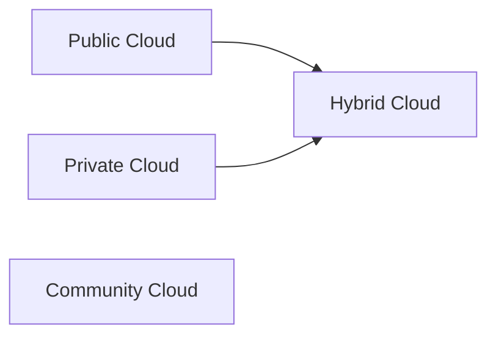
*Figure 8: Cloud Deployment Models*

## Administering & Monitoring Cloud Services

Administering and monitoring cloud services are crucial for ensuring the performance, availability, security, and cost-effectiveness of cloud deployments. Cloud providers offer a range of tools and services for these purposes.

**Administering Cloud Services:**

* **Resource Provisioning and Management:** Setting up and configuring virtual machines, storage, databases, networks, and other cloud resources.
* **User and Access Management:** Controlling who has access to cloud resources and what actions they can perform (Identity and Access Management - IAM).
* **Configuration Management:** Automating the configuration and desired state of cloud resources.
* **Security Management:** Configuring firewalls, security groups, encryption, and other security measures.
* **Cost Management:** Monitoring cloud spending, setting budgets, and optimizing resource utilization to control costs.
* **Backup and Disaster Recovery:** Implementing strategies to back up data and applications and recover them in case of a failure.

**Monitoring Cloud Services:**

* **Performance Monitoring:** Tracking metrics like CPU usage, memory consumption, network traffic, and application response times to identify performance bottlenecks.
* **Availability Monitoring:** Ensuring that cloud services are accessible and operational.
* **Logging and Auditing:** Collecting and analyzing logs to track activity, troubleshoot issues, and ensure compliance.
* **Alerting and Notifications:** Setting up alerts to be notified of specific events or thresholds being breached (e.g., high CPU usage, service downtime).
* **Security Monitoring:** Detecting and responding to security threats and anomalies.
* **Cost Monitoring:** Tracking costs in real-time and analyzing spending patterns.

**Suitable Image/Graph:** A diagram showing a centralized monitoring and administration platform interacting with various cloud services.

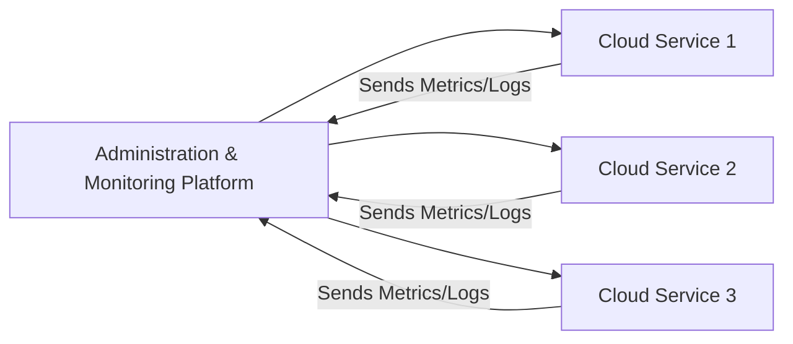
*Figure 9: Cloud Administration and Monitoring*

## Benefits and Limitations of Cloud Computing

Cloud computing offers numerous advantages, but it also comes with certain limitations that organizations need to consider.

**Benefits:**

* **Cost Savings:** Reduced capital expenditure (no need to buy and maintain hardware), pay-as-you-go pricing, and lower operational costs.
* **Scalability and Elasticity:** Easily scale resources up or down based on demand, providing flexibility and avoiding over-provisioning.
* **Agility and Speed:** Rapid deployment of applications and resources, enabling faster innovation and time to market.
* **High Availability and Reliability:** Cloud providers offer robust infrastructure with built-in redundancy and failover mechanisms.
* **Global Reach:** Deploy applications and access data from anywhere in the world.
* **Focus on Core Business:** Organizations can focus on their core competencies instead of managing IT infrastructure.
* **Automatic Updates and Maintenance:** Providers handle software updates and infrastructure maintenance.
* **Disaster Recovery and Business Continuity:** Easier to implement robust backup and disaster recovery strategies.

**Limitations:**

* **Internet Connectivity Dependence:** Requires a stable internet connection to access cloud services.
* **Security Concerns:** While providers invest heavily in security, concerns about data privacy, breaches, and compliance remain.
* **Vendor Lock-in:** Difficulty in migrating from one cloud provider to another due to proprietary technologies or data formats.
* **Limited Control:** Less control over the underlying infrastructure compared to on-premises deployments.
* **Performance Issues:** Performance can be affected by network latency and the shared nature of some cloud resources.
* **Compliance and Regulatory Issues:** Ensuring compliance with industry-specific regulations and data sovereignty laws can be complex.
* **Potential for Increased Costs:** While initially cost-effective, costs can escalate with high usage or inefficient resource management.

**Suitable Image/Graph:** A simple pro/con list or a balance scale diagram illustrating the benefits and limitations.

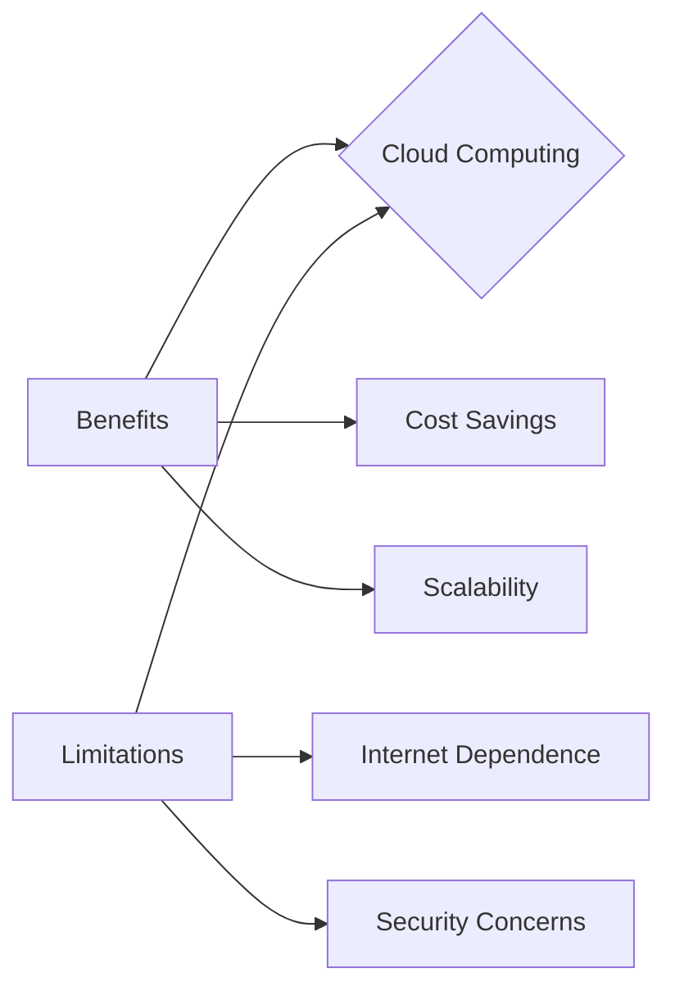
*Figure 10: Benefits and Limitations of Cloud Computing*

## Study of a Hypervisor

A hypervisor, also known as a Virtual Machine Monitor (VMM), is a layer of software, firmware, or hardware that enables the creation and running of virtual machines (VMs). It allows a single physical machine (host) to host multiple virtual machines (guests), each running its own operating system and applications, while sharing the host's underlying hardware resources.

**Function:**

The primary function of a hypervisor is to abstract the underlying hardware resources (CPU, memory, storage, networking) and present a virtualized view of these resources to each guest VM. It manages the allocation and sharing of these resources among the VMs, ensuring that they can run concurrently without interfering with each other.

**How it works:**

The hypervisor sits between the hardware and the operating systems of the VMs. It intercepts the privileged calls made by the guest operating systems and translates them into actions on the physical hardware. This allows multiple operating systems to run in isolation on the same machine.

**Types of Hypervisors:**

There are two main types of hypervisors:

* **Type 1 Hypervisor (Bare-Metal Hypervisor):**
    * **Description:** This type of hypervisor runs directly on the host hardware, without an underlying operating system. It acts as a lightweight operating system itself, managing the hardware resources and providing a platform for the guest VMs.
    * **Characteristics:** Offers better performance and security because it has direct access to the hardware.
    * **Examples:** VMware ESXi, Microsoft Hyper-V, Xen.

* **Type 2 Hypervisor (Hosted Hypervisor):**
    * **Description:** This type of hypervisor runs as an application on top of a conventional operating system (the host OS). The host OS manages the hardware resources, and the hypervisor manages the guest VMs.
    * **Characteristics:** Easier to install and use, but may have slightly lower performance compared to Type 1 due to the overhead of the host OS.
    * **Examples:** VMware Workstation, Oracle VirtualBox.

**Suitable Image/Graph:** Diagrams illustrating the architecture of Type 1 and Type 2 hypervisors.

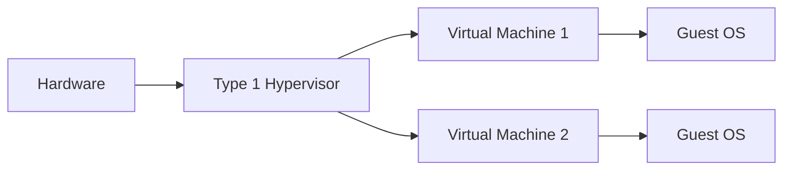
*Figure 11: Type 1 Hypervisor Architecture*

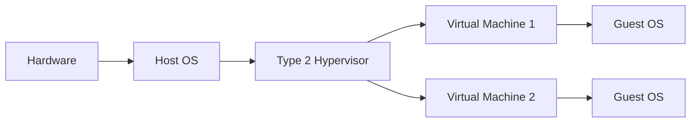
*Figure 12: Type 2 Hypervisor Architecture*

This concludes the in-depth explanation of each topic with suitable images and graphs.
