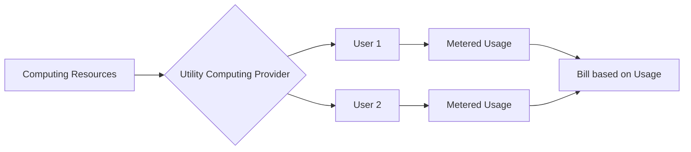
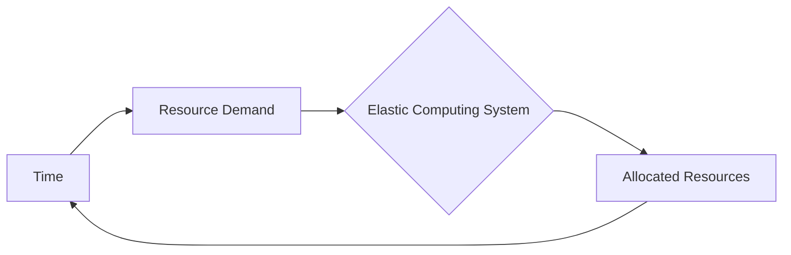
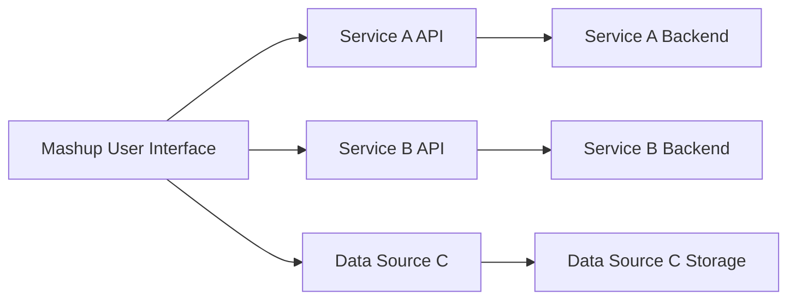
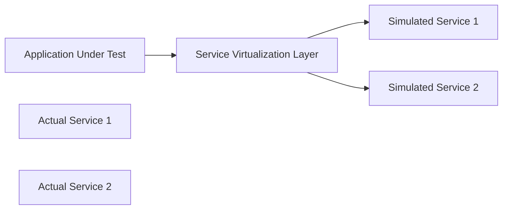
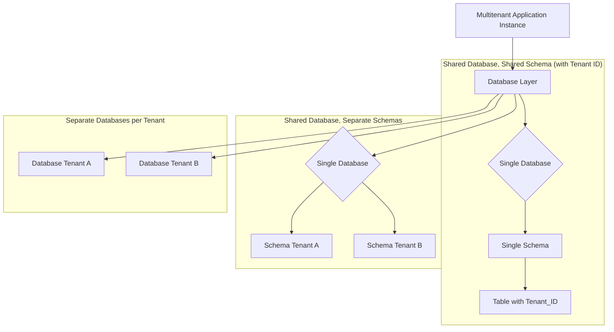

Let's continue our in-depth exploration of cloud computing and related concepts with the next set of topics.

## Utility Computing

Utility computing is a business model for the delivery of computing resources as a metered service, similar to how traditional utilities like electricity, water, or gas are provided. In this model, users access computing power, storage, and applications on demand and pay only for the resources they consume.

**Key Characteristics:**

* **Pay-per-use:** The most defining characteristic is the billing model, where costs are based on actual consumption of resources (e.g., CPU time, data storage, network bandwidth).
* **On-demand availability:** Resources are available instantly or very quickly as needed by the user.
* **Scalability:** Users can easily increase or decrease their resource consumption based on fluctuating demands.
* **Metered usage:** Resource usage is tracked and measured accurately to enable the pay-per-use model.
* **Abstraction of infrastructure:** Users are abstracted from the underlying physical infrastructure; they don't need to manage hardware or low-level software.

**Benefits:**

* **Cost Efficiency:** Eliminates the need for significant upfront investments in hardware and software. Costs become operational expenses (OpEx) rather than capital expenses (CapEx).
* **Flexibility and Agility:** Organizations can quickly provision and de-provision resources, allowing them to respond rapidly to changing business needs and market conditions.
* **Scalability:** Easily handle peak loads and unpredictable demand without investing in excess capacity.
* **Reduced IT Management Overhead:** The provider is responsible for managing and maintaining the underlying infrastructure.
* **Access to Advanced Resources:** Users can access a wide range of computing resources and services that they might not be able to afford or manage on their own.

**Relationship with Cloud Computing:**

Utility computing is a foundational concept for cloud computing. Cloud computing platforms often utilize a utility computing model to deliver their services (IaaS, PaaS, SaaS) on a pay-per-use basis with on-demand scalability.

**Suitable Image/Graph:** An illustration comparing utility computing to a traditional utility service like electricity, showing a meter and a usage-based bill.


*Figure 13: Utility Computing Model Analogy*

## Elastic Computing

Elastic computing is a characteristic of cloud computing that refers to the ability to dynamically scale IT resources up or down automatically in response to changing workload demands. It's a key enabler of the agility and cost-effectiveness offered by cloud platforms.

**Definition:** The ability to automatically and quickly provision and de-provision computing resources to match fluctuating demand.

**Key Features and Advantages:**

* **Automatic Scaling:** Resources are scaled without manual intervention based on pre-defined policies or real-time monitoring of metrics like CPU utilization or network traffic.
* **Rapid Provisioning:** New resources can be made available very quickly when demand increases.
* **Cost Optimization:** By automatically scaling down during periods of low demand, organizations avoid paying for underutilized resources.
* **Improved Performance and Availability:** Ensures that applications have sufficient resources to perform optimally and remain available even during traffic spikes.
* **Increased Agility:** Allows organizations to easily handle unpredictable workloads and new initiatives.

**How it enables Dynamic Scaling:**

Elastic computing relies on virtualization and automation. Cloud platforms monitor the resource utilization of applications and, when certain thresholds are met (e.g., CPU usage exceeds 70%), trigger the provisioning of additional resources (e.g., adding more virtual machines). Conversely, when resource utilization drops, the platform automatically de-provisions resources to save costs. This dynamic adjustment ensures that resources are always aligned with the current demand.

**Suitable Image/Graph:** A graph showing resource usage over time with peaks and valleys, and how elastic computing dynamically adjusts the allocated resources to match the demand.


*Figure 14: Elastic Computing - Dynamic Scaling*

## Ajax: Asynchronous ‘Rich’ Interfaces

AJAX (Asynchronous JavaScript and XML) is a set of web development techniques used on the client-side to create asynchronous web applications. It allows web pages to update content dynamically without requiring a full page reload, leading to more interactive and responsive user interfaces.

**Definition:** A technique for creating dynamic and interactive web applications by exchanging small amounts of data with the server in the background without reloading the entire page.

**Role in Asynchronous ‘Rich’ Interfaces:**

Traditional web applications were largely synchronous. When a user interacted with an element that required data from the server (e.g., clicking a button to display more information), the entire page would typically be reloaded. This resulted in a choppy user experience. AJAX enables asynchronous communication, meaning the browser can send a request to the server and continue to display the current page while waiting for the server's response. Once the response is received, JavaScript can dynamically update specific parts of the page with the new data, creating a richer and more fluid user interface that feels more like a desktop application.

**Underlying Technologies:**

AJAX is not a single technology but a combination of several existing web technologies used together:

* **HTML/XHTML and CSS:** For structuring and styling the presentation of the web page.
* **The Document Object Model (DOM):** Allows JavaScript to dynamically access and manipulate the content and structure of the web page.
* **XMLHttpRequest Object (or the newer Fetch API):** The core object that enables asynchronous communication with the server to send and receive data.
* **XML (historically) or JSON (more commonly now):** For formatting the data exchanged between the client and the server.
* **JavaScript:** Acts as the orchestrator, bringing all these technologies together to handle user interactions, make asynchronous requests, process the server's response, and update the DOM.

**Suitable Image/Graph:** A diagram illustrating the difference between a traditional synchronous web interaction and an asynchronous AJAX interaction.

```mermaid
graph LR
    subgraph Traditional (Synchronous)
        A[User Action] --> B{Send Request & Wait}
        B --> C[Server Processing]
        C --> D{Send Full Page Response}
        D --> E[Browser Reloads Page]
        E --> F[User Sees Update]
    end
    subgraph AJAX (Asynchronous)
        G[User Action] --> H{Send Async Request}
        H --> I[Server Processing]
        I --> J{Send Data Response}
        J --> K[JavaScript Updates Part of Page]
        G --> K
        K --> L[User Sees Update]
    end
```
*Figure 15: Synchronous vs. Asynchronous (AJAX) Web Interaction*

## Mashups: User Interface and Services Integration

A mashup is a web application that combines data, presentation, or functionality from two or more sources to create a new and unique service or interface. The focus is on integrating existing services and data to provide enhanced value to the end user, often with a user interface that seamlessly blends the different sources.

**Definition:** A web application that integrates content or functionality from multiple sources into a single new application.

**User Interface Aspect:**

A key characteristic of mashups is their user interface, which acts as a single point of access to the integrated content and services. The UI presents data and functionalities from disparate sources in a unified and often visually appealing manner. This can involve embedding maps with location data, displaying data visualizations alongside related information, or combining search results from multiple engines. The goal is to provide a richer and more convenient user experience by bringing relevant information and tools together in one place.

**Services Integration:**

Mashups rely heavily on the integration of services exposed by different providers. These services are typically accessed through APIs (Application Programming Interfaces), which can be based on various technologies like REST or SOAP. The mashup application calls these APIs to retrieve data or trigger actions from the source services. The integration logic can reside on the client-side (using technologies like AJAX) or on the server-side.

**Suitable Image/Graph:** A diagram showing a mashup user interface pulling data and functionality from multiple distinct services.


*Figure 16: Mashup Architecture - Integrating Multiple Sources*

## Services Virtualization Technology

Services virtualization is a technology that is often used in software testing and development environments. It involves capturing and simulating the behavior of dependent services that are not available, still under development, or difficult to access for testing purposes. This allows development and testing teams to work independently without waiting for the actual services to be ready or accessible.

**Definition:** The act of simulating the behavior of dependent services in a composite application environment to enable parallel development and testing.

**Virtualization Applications in Enterprises:**

* **Parallel Development:** Development teams can work on different parts of an application that depend on each other concurrently, even if the dependent services are not yet fully implemented.
* **Independent Testing:** Quality Assurance (QA) teams can test applications without requiring live connections to all dependent services, which can be unreliable or unavailable.
* **Reduced Testing Costs:** Reduces the need for dedicated test environments for each dependent service.
* **Faster Feedback Loops:** Developers and testers get faster feedback as they don't have to wait for downstream services.
* **Simulating Unavailable Systems:** Can simulate the behavior of mainframe systems, third-party services, or other systems that are difficult to access for testing.
* **Performance Testing:** Can simulate the load and response times of dependent services to performance test an application in isolation.

**Pitfalls of Virtualization (in a broader IT sense, applicable to services virtualization as well):**

While virtualization offers many benefits, there are potential challenges:

* **Management Complexity:** Managing a large number of virtualized services or VMs can become complex without proper tools and processes.
* **Resource Contention:** Multiple VMs or virtualized services competing for the same underlying physical resources can lead to performance issues if not managed effectively.
* **Security Risks:** Improperly configured virtualization environments can introduce security vulnerabilities.
* **Licensing Challenges:** Software licensing in virtualized environments can be complex.
* **Vendor Lock-in:** Dependence on a specific virtualization vendor's technology.
* **Skill Gap:** Requires personnel with expertise in virtualization technologies.

**Suitable Image/Graph:** A diagram showing a development or testing environment using a service virtualization layer to interact with simulated services instead of actual services.


*Figure 17: Services Virtualization in a Testing Environment*

## Multitenant Software

Multitenant software is a software architecture where a single instance of the software application and its underlying infrastructure serves multiple customers, referred to as tenants. Each tenant's data and configurations are isolated and remain invisible to other tenants, even though they share the same software instance.

**Definition:** A software architecture where a single instance of the software runs on a server and serves multiple tenants (customers).

**Multi-entity Support:**

Multitenancy inherently provides multi-entity support, as the software is designed to manage and isolate data and configurations for numerous distinct tenants within a single deployment. Each tenant operates as an independent entity within the shared software instance.

**Multi-schema Approach:**

One common approach to achieving data isolation in multitenant databases is the multi-schema approach. In this model, while all tenants share the same database server, each tenant has its own separate database schema. A schema is a collection of database objects, such as tables, views, and indexes. This provides a strong level of data isolation between tenants, as each tenant's data is stored within their dedicated schema.

**Multitenancy using Cloud Data Stores:**

Cloud data stores (databases offered as a cloud service) are well-suited for supporting multitenant applications. Cloud providers offer various database options and features that facilitate multitenancy:

* **Shared Database, Separate Schemas:** As described above, this model can be implemented using cloud databases that support multiple schemas within a single database instance (e.g., PostgreSQL, MySQL).
* **Shared Database, Shared Schema with Tenant Discriminator:** In this model, all tenants share the same database tables within a single schema. A "tenant ID" column is added to each relevant table to identify which tenant each row of data belongs to. Queries are filtered based on the tenant ID to ensure data isolation. This approach is often the most cost-effective but requires careful application design to ensure data segregation.
* **Separate Databases per Tenant:** While this technically moves away from a *single instance* in the strictest sense for the database layer, some multitenant architectures use separate database instances for each tenant, all managed within the cloud provider's infrastructure. This provides the highest level of data isolation and can be suitable for tenants with very strict security or performance requirements, but it is generally more expensive to manage. Cloud database services make it easier to provision and manage multiple database instances.
* **Cloud-native Multitenancy Features:** Some cloud database services offer built-in features or best practices specifically designed to support multitenancy, simplifying the implementation of data isolation and management.

**Suitable Image/Graph:** A diagram illustrating the different data isolation approaches in multitenant databases (shared schema with discriminator, separate schemas, separate databases).


*Figure 18: Multitenant Database Isolation Approaches*
