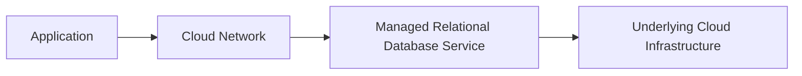
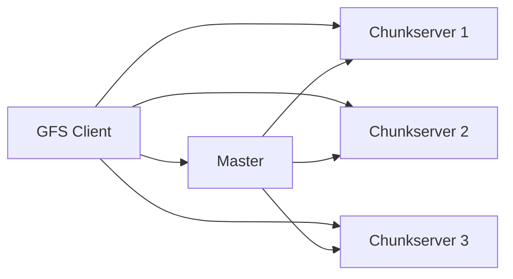
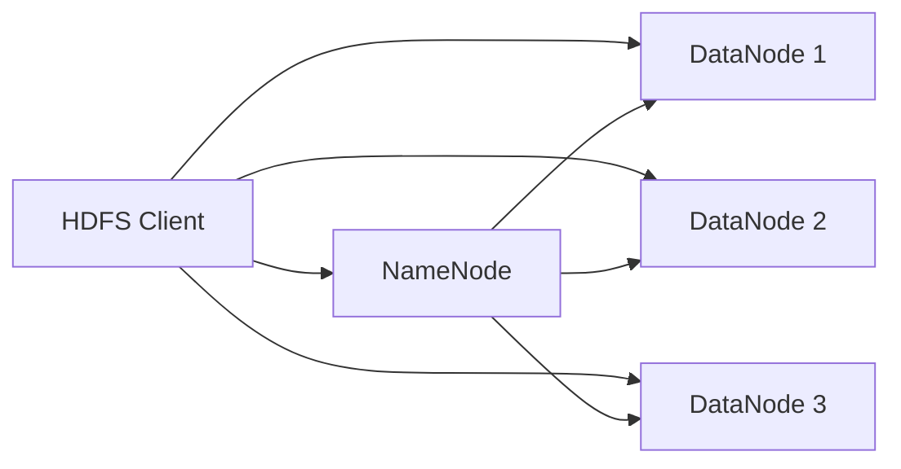
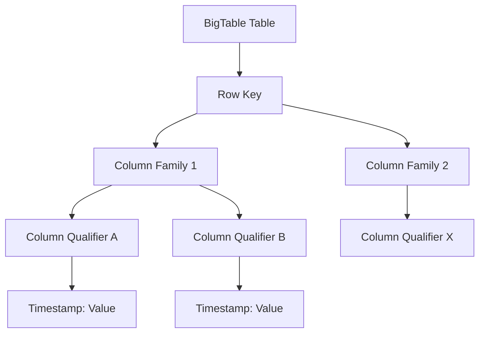
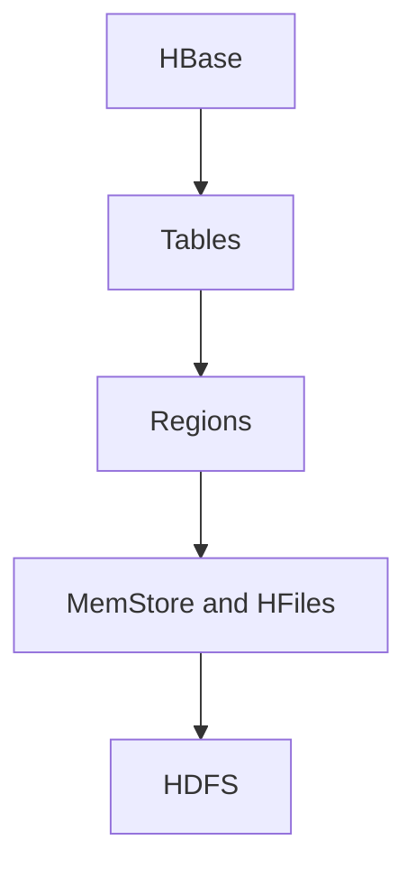
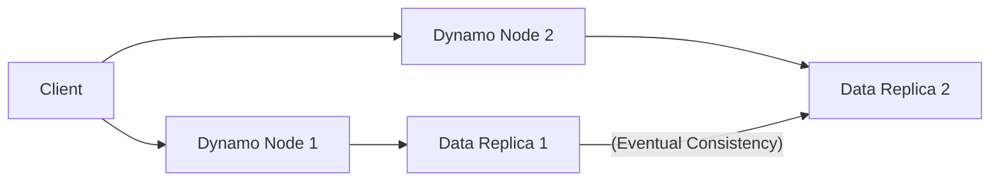
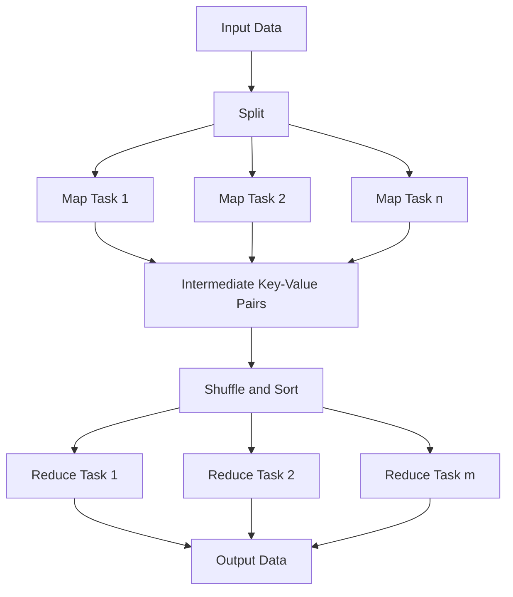

Let's continue our exploration of data management and processing in the cloud.

## Data in the Cloud: Relational Databases

Relational databases have been a cornerstone of data management for decades, and they continue to play a significant role in cloud computing environments. Cloud providers offer managed relational database services that abstract away the complexities of database administration, allowing users to focus on their applications.

**Definition:** A database that organizes data into one or more tables (or relations) where data types are formally defined, and relationships between tables are represented by shared columns (foreign keys referencing primary keys).

**Relational Databases in Cloud Environments:**

Cloud platforms offer various options for deploying and managing relational databases:

* **Managed Database Services (DBaaS):** This is the most common approach in the cloud. The cloud provider manages the underlying infrastructure, database software installation and patching, backups, scaling, and high availability. Examples include Amazon RDS, Google Cloud SQL, and Azure Database for MySQL, PostgreSQL, etc.
* **Self-Managed Databases on VMs:** Users can also install and manage relational database software on virtual machines hosted in the cloud. This provides more control but requires more administrative effort.

**Benefits of using Relational Databases in the Cloud:**

* **Ease of Management:** Managed services significantly reduce the administrative burden of running a database.
* **Scalability:** Cloud databases can be easily scaled up or down to meet changing performance and storage requirements.
* **High Availability and Durability:** Cloud providers offer built-in features for replication, failover, and automated backups to ensure data availability and durability.
* **Cost-Effectiveness:** Pay-as-you-go pricing models can be more cost-effective than managing on-premises databases, especially for variable workloads.
* **Integration with other Cloud Services:** Seamless integration with other cloud services like computing, analytics, and monitoring.

**Considerations:**

* **Vendor Lock-in:** Using a specific cloud provider's managed database service might create vendor lock-in.
* **Performance:** Performance can be dependent on the chosen instance size, storage type, and network latency.
* **Security:** While providers offer security features, users are responsible for configuring and managing access controls and data encryption.
* **Cost Management:** It's crucial to monitor usage and optimize configurations to control costs in a pay-as-you-go model.

**Suitable Image/Graph:** A diagram showing an application interacting with a managed relational database service in the cloud.


*Figure 19: Relational Database in the Cloud*

## Cloud File Systems: GFS and HDFS

Traditional file systems are designed for single machines. Cloud file systems, also known as distributed file systems, are designed to store and manage large amounts of data across a cluster of machines, providing high throughput, fault tolerance, and scalability. Two prominent examples are Google File System (GFS) and Hadoop Distributed File System (HDFS).

**Google File System (GFS):**

* **Purpose:** Developed by Google to handle their internal data storage needs for large-scale distributed applications like web search and other services. It was designed for handling very large files with high sequential read and append operations, prioritizing throughput over low latency.
* **Architecture:** GFS has a master-slave architecture consisting of:
    * **Master:** Manages the file system metadata (namespace, access control information, mapping from files to chunks, chunk locations). There is typically a single master, which can be a single point of failure, though techniques are used to mitigate this.
    * **Chunkservers:** Store the actual file data, which is divided into fixed-size chunks (typically 64MB). Each chunk is replicated across multiple chunkservers for fault tolerance.
    * **Clients:** Interact with the master to get metadata and with chunkservers to read and write data.
* **Features:** Large file support, high sequential read and append performance, data replication for fault tolerance, relaxed consistency model (to optimize for appends), and efficient handling of concurrent appends.

**Suitable Image/Graph (GFS):** A diagram showing the GFS architecture with a master, multiple chunkservers, and clients interacting with them.


*Figure 20: Google File System (GFS) Architecture*

**Hadoop Distributed File System (HDFS):**

* **Purpose:** The primary distributed storage system used by Apache Hadoop. It was inspired by GFS and designed to store large datasets across clusters of commodity hardware for batch processing, particularly with the MapReduce processing framework.
* **Architecture:** HDFS also follows a master-slave architecture:
    * **NameNode:** The master daemon that manages the file system namespace and stores the metadata. There can be a secondary NameNode or High Availability (HA) setup to address the single point of failure issue.
    * **DataNodes:** Slave daemons that store the actual data blocks (default block size is 128MB or 256MB) and perform read/write operations. Data blocks are replicated across multiple DataNodes for fault tolerance.
    * **Clients:** Interact with the NameNode for metadata and with DataNodes for data access.
* **Features:** Large file support, high throughput for batch processing, data replication for fault tolerance, designed for streaming data access, can run on commodity hardware, and forms the storage layer for the Hadoop ecosystem.

**Suitable Image/Graph (HDFS):** A diagram showing the HDFS architecture with a NameNode, multiple DataNodes, and clients interacting with them.


*Figure 21: Hadoop Distributed File System (HDFS) Architecture*

## Features and Comparisons among GFS, HDFS, etc.

While GFS and HDFS share many similarities due to HDFS being inspired by GFS, there are some key differences and features worth comparing. Other distributed file systems exist as well, each with its own strengths and weaknesses (e.g., Ceph, Lustre), but we will focus on the comparison between GFS and HDFS as per the prompt.

| Feature            | Google File System (GFS)                     | Hadoop Distributed File System (HDFS)              |
|--------------------|----------------------------------------------|----------------------------------------------------|
| **Origin** | Google (Proprietary)                         | Apache Software Foundation (Open Source)           |
| **Primary Use** | Internal Google applications                | Hadoop ecosystem, Batch Processing (MapReduce)   |
| **Architecture** | Single Master, Multiple Chunkservers        | NameNode (Master), Multiple DataNodes (Slaves)     |
| **Metadata Management** | Single Master (Potential SPoF), In-memory  | NameNode (Potential SPoF, mitigated by HA), In-memory + Disk |
| **Data Storage Unit**| Chunks (typically 64MB)                      | Blocks (default 128MB or 256MB)                  |
| **Replication** | Configurable, typically 3 replicas           | Configurable, default typically 3 replicas         |
| **Consistency Model**| Relaxed Consistency (for appends)            | Write-once, Read-many (stronger consistency for writes) |
| **Fault Tolerance**| Handled by Master and data replication      | Handled by NameNode and DataNode heartbeats, data replication |
| **Concurrency** | Allows concurrent appends                   | Primarily supports write-once semantics, but appends are possible |
| **Performance Focus**| High sustained bandwidth, especially for large sequential reads and appends | High throughput for batch processing              |

**Suitable Image/Graph:** A table comparing the features as shown above would be the most suitable visual representation. A diagram could show the lineage, with HDFS branching off from the concepts introduced by GFS.

```mermaid
graph LR
    A[Concepts from GFS Whitepaper] --> B[Hadoop Distributed File System (HDFS)]
    A --> C[Google File System (GFS - Internal)]
```
*Figure 22: Conceptual Relationship between GFS and HDFS*

## BigTable, Hbase, and Dynamo

These are examples of NoSQL (Not Only SQL) data stores that are designed to handle large volumes of unstructured or semi-structured data, often providing high availability, scalability, and performance for specific use cases, differing from traditional relational databases.

**BigTable:**

* **Definition:** A compressed, high-performance, proprietary distributed storage system developed by Google. It is a sparse, distributed persistent multi-dimensional sorted map.
* **Data Model:** Organizes data into tables, rows, and column families.
    * **Rows:** Identified by a row key. Rows are sorted lexicographically by row key.
    * **Column Families:** Groups of related columns. Columns within a family are dynamically created.
    * **Columns:** Identified by a column family and a column qualifier.
    * **Timestamps:** Each cell (intersection of row and column) can contain multiple versions of data, timestamped.
* **Characteristics:** Highly scalable, high throughput, low latency for reads and writes, designed for large datasets, sparse (doesn't store null values), and fault-tolerant.
* **Use Cases:** Web indexing, Google Earth, time-series data, large-scale analytics.

**Suitable Image/Graph (BigTable):** A simplified diagram showing the BigTable data model with rows, column families, columns, and timestamps.


*Figure 23: Simplified BigTable Data Model*

**HBase:**

* **Definition:** An open-source, distributed, versioned, non-relational database modeled after Google's BigTable. It runs on top of HDFS and is part of the Apache Hadoop ecosystem.
* **Data Model:** Similar to BigTable, it is a sparse, distributed persistent multi-dimensional sorted map indexed by row key, column family, column qualifier, and timestamp.
* **Characteristics:** Horizontally scalable, fault-tolerant (inherits from HDFS), strong consistency for row-level operations, integrates with MapReduce, and provides random real-time read/write access to data in HDFS.
* **Use Cases:** Large-scale data processing, near real-time access to big data, time-series data, and applications requiring random read/write access to massive datasets.

**Suitable Image/Graph (HBase):** A diagram similar to the BigTable data model, emphasizing its structure on top of HDFS.


*Figure 24: Simplified HBase Architecture on HDFS*

**Dynamo:**

* **Definition:** A highly available, proprietary key-value store developed by Amazon to power its e-commerce platform. It is designed for eventually consistent reads and writes with high availability as the primary goal.
* **Data Model:** A simple key-value model, where each data item is identified by a unique key and has a value (which can be a complex object).
* **Characteristics:** Highly available, eventually consistent (conflicting versions of data can exist temporarily), partition tolerant, uses techniques like consistent hashing and vector clocks to manage data distribution and resolve conflicts, and designed for read and write availability even during network partitions.
* **Use Cases:** Shopping carts, session management, and other applications requiring extremely high availability and the ability to tolerate temporary data inconsistencies.

**Suitable Image/Graph (Dynamo):** A diagram showing a distributed key-value store with data replicated across multiple nodes, highlighting eventual consistency.


*Figure 25: Simplified Dynamo Key-Value Store Concept*

## Map-Reduce and Extensions

Map-Reduce is a programming model and an associated implementation for processing large datasets in parallel across a distributed computing environment. It simplifies the process of writing parallel applications for big data processing.

**Definition:** A programming model for processing large datasets with a parallel, distributed algorithm on a cluster.

**Parallel Computing in this Context:**

Map-Reduce leverages the power of parallel computing by dividing a large data processing task into smaller, independent sub-tasks that can be executed simultaneously on multiple nodes in a cluster. This significantly reduces the time required to process massive datasets compared to traditional serial processing.

**The Map-Reduce Model:**

The Map-Reduce model consists of two main phases:

* **Map Phase:**
    * The input data is divided into smaller chunks (splits).
    * Each chunk is processed by a "mapper" task.
    * The mapper function takes key-value pairs as input and produces a set of intermediate key-value pairs. The logic within the mapper is user-defined and performs filtering, sorting, or transformation of the data.

* **Reduce Phase:**
    * The intermediate key-value pairs from all mapper tasks are grouped and sorted by key.
    * The grouped values for each unique key are then processed by a "reducer" task.
    * The reducer function takes a key and a list of associated values as input and produces a final set of output key-value pairs. The logic within the reducer is user-defined and typically performs aggregation, summarization, or further processing of the grouped data.

There are also intermediate steps like shuffling and sorting that prepare the data for the reduce phase.

**Parallel Efficiency of Map-Reduce:**

The parallel efficiency of Map-Reduce depends on several factors:

* **Data Partitioning:** How effectively the input data is split and distributed among mapper tasks.
* **Load Balancing:** Ensuring that the workload is evenly distributed across the available nodes and tasks.
* **Network I/O:** The amount of data transferred between mappers and reducers during the shuffling phase can be a bottleneck.
* **Skew in Data:** If some keys have significantly more values than others, the reducer processing those keys can become a bottleneck.
* **Task Granularity:** The size of the tasks should be appropriate for the cluster size and workload.

When designed effectively, Map-Reduce can achieve high parallel efficiency, allowing for significant speedups in processing large datasets.

**Suitable Image/Graph (Map-Reduce Phases):** A diagram illustrating the flow of data through the Map and Reduce phases.


*Figure 26: The Map-Reduce Model Phases*

## Relational Operations using Map-Reduce

While Map-Reduce is not a relational database system, it can be used to perform relational-style operations on large datasets stored in distributed file systems like HDFS. These operations are implemented by writing custom Map and Reduce functions.

Examples of relational operations that can be implemented with Map-Reduce:

* **Selection ($\sigma$):** Filtering rows based on a condition. The Map function reads each record and outputs the record if it satisfies the selection condition. The Reduce function simply passes through the records it receives.
* **Projection ($\pi$):** Selecting specific columns from a relation. The Map function reads each record, extracts the desired columns, and outputs a new record with only those columns. The Reduce function passes through the projected records.
* **Join ($\Join$):** Combining data from two relations based on a common attribute. This is a more complex operation in Map-Reduce, often involving distributing data based on the join key (Map phase) and then joining the matching records in the Reduce phase.
* **Aggregation ($\gamma$):** Performing aggregate functions (e.g., SUM, COUNT, AVG) on groups of data. The Map function can emit key-value pairs where the key is the grouping attribute and the value is the value to be aggregated. The Reduce function receives all values for a given key and performs the aggregation.

Implementing these operations in Map-Reduce requires careful consideration of data partitioning and shuffling to ensure that related data is brought together for the Reduce phase.

**Suitable Image/Graph:** A diagram showing how data from two datasets might be processed through Map-Reduce to perform a join operation.

```mermaid
graph LR
    A[Dataset A] --> B[Map A (Key by Join Key)]
    C[Dataset B] --> D[Map B (Key by Join Key)]
    B --> E[Shuffle & Sort (Group by Join Key)]
    D --> E
    E --> F[Reduce (Perform Join)]
    F --> G[Joined Output]
```
*Figure 27: Implementing a Join Operation with Map-Reduce*

## Enterprise Batch Processing using Map-Reduce

Batch processing is a method of running programs that process data in large batches, typically without manual intervention, and often scheduled to run at specific times (e.g., daily, weekly). Map-Reduce is well-suited for enterprise batch processing due to its ability to handle large volumes of data and its inherent parallelism and fault tolerance.

**Scenarios for Enterprise Batch Processing with Map-Reduce:**

* **ETL (Extract, Transform, Load) Processes:** Extracting data from various sources, transforming it into a desired format, and loading it into a data warehouse or other destination. Map-Reduce can parallelize the transformation phase for massive datasets.
* **Log Analysis:** Processing large volumes of log files to extract insights, generate reports, or detect anomalies.
* **Data Migration:** Migrating large datasets from one storage system to another.
* **Report Generation:** Generating complex reports from large datasets.
* **Data Cleansing and Validation:** Identifying and correcting errors or inconsistencies in large datasets.
* **Risk Analysis and Fraud Detection:** Processing large volumes of transactional data to identify patterns indicative of risk or fraud.

Map-Reduce provides a robust and scalable framework for these types of batch processing tasks, distributing the workload across a cluster and handling failures gracefully.

**Suitable Image/Graph:** A diagram showing a batch processing pipeline where Map-Reduce is used for the processing step on a large dataset.

```mermaid
graph LR
    A[Data Source 1] --> D[Data Ingestion (to HDFS)]
    B[Data Source 2] --> D
    C[Data Source n] --> D
    D --> E[Large Dataset (in HDFS)]
    E --> F[Map-Reduce Processing]
    F --> G[Processed Data (in HDFS)]
    G --> H[Reporting/Analytics/Storage]
```
*Figure 28: Enterprise Batch Processing with Map-Reduce*

## Example/Application of Map-Reduce: Word Count

The "Word Count" example is the classic illustration of the Map-Reduce model. The goal is to count the occurrences of each word in a large collection of text documents.

**Scenario:** Count the frequency of each word in a massive text corpus.

**Map-Reduce Implementation:**

* **Input:** A collection of text documents.
* **Map Function:**
    * Takes a portion of a document (e.g., a line) as input.
    * Splits the text into individual words.
    * For each word, emits a key-value pair where the key is the word and the value is 1 (representing one occurrence).
    * Example: Input "hello world hello" -> Output: ("hello", 1), ("world", 1), ("hello", 1)

* **Shuffle and Sort:**
    * The framework collects all intermediate key-value pairs from all mapper tasks.
    * It groups the values by key, creating a list of values for each unique word.
    * Example: Intermediate: ("hello", 1), ("world", 1), ("hello", 1) -> Grouped: ("hello", [1, 1]), ("world", [1])

* **Reduce Function:**
    * Takes a word (key) and a list of 1s (values) as input.
    * Sums the values in the list to get the total count for that word.
    * Emits a final key-value pair where the key is the word and the value is the total count.
    * Example: Input: ("hello", [1, 1]) -> Output: ("hello", 2); Input: ("world", [1]) -> Output: ("world", 1)

**How it achieves Parallelism:**

Multiple mapper tasks process different parts of the input text concurrently. The shuffling and sorting phase efficiently distributes the intermediate results, and multiple reducer tasks process different groups of words in parallel. This allows for counting words in a massive dataset much faster than processing it on a single machine.

**Suitable Image/Graph:** A diagram illustrating the Word Count example, showing the input, the map phase emitting intermediate pairs, the shuffling and sorting phase grouping by key, and the reduce phase aggregating the counts.

```mermaid
graph LR
    A[Input Text] --> B[Split 1]
    A --> C[Split 2]
    B --> D[Map Task 1]
    C --> E[Map Task 2]
    D --> F[("word1", 1), ("word2", 1), ...]
    E --> G[("word1", 1), ("word3", 1), ...]
    F --> H[Shuffle & Sort]
    G --> H
    H --> I[("word1", [1, 1]), ("word2", [1]), ("word3", [1]), ...]
    I --> J[Reduce Task 1 (for word1)]
    I --> K[Reduce Task 2 (for word2, word3)]
    J --> L[("word1", 2)]
    K --> M[("word2", 1), ("word3", 1)]
    L --> N[Final Counts]
    M --> N
```
*Figure 29: Map-Reduce Word Count Example*
