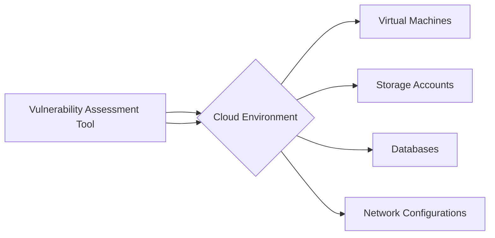
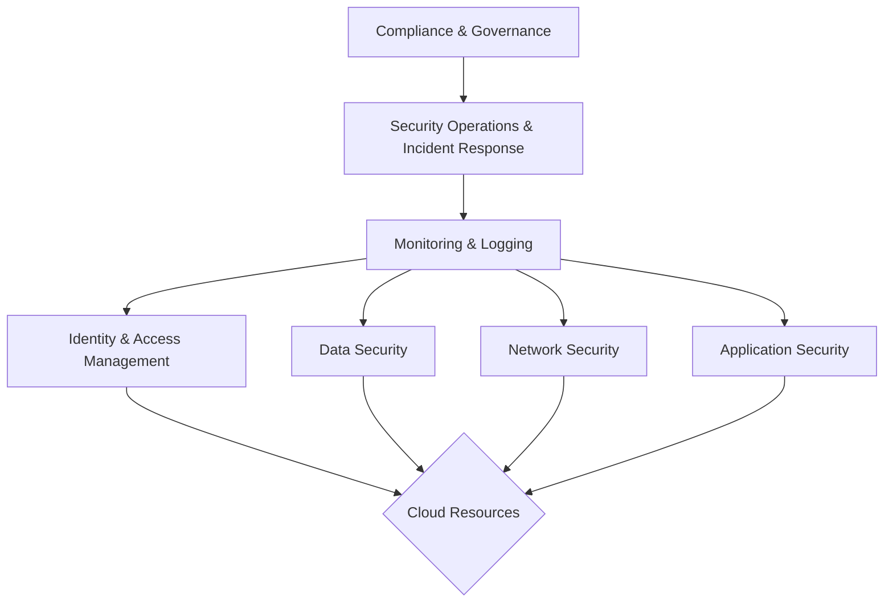
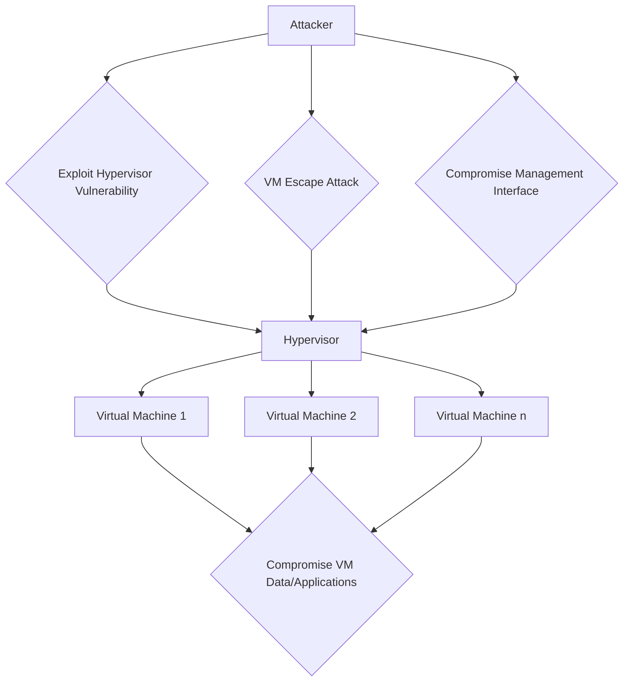
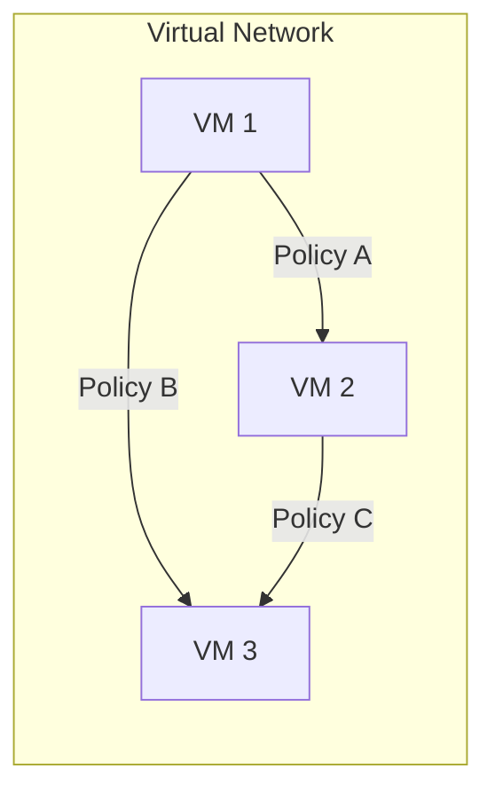
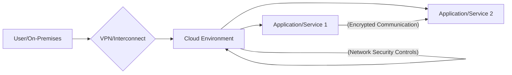

Let's delve into the crucial aspects of cloud security, covering its fundamentals, tools, architectural considerations, challenges, and techniques for securing virtualized environments and communications.

## Cloud Security Fundamentals

Cloud security refers to the set of policies, technologies, applications, and controls utilized to protect virtualized IP, data, applications, services, and the associated infrastructure of cloud computing. It is a shared responsibility between the cloud service provider (CSP) and the customer. Understanding the fundamental principles is crucial for establishing a strong security posture in the cloud.

**Key Principles:**

* **Confidentiality:** Ensuring that data is only accessible to authorized individuals or systems. This involves encryption of data at rest and in transit, as well as strict access controls.
* **Integrity:** Maintaining the accuracy and completeness of data, ensuring it has not been tampered with during storage or transmission. This is achieved through mechanisms like hashing and digital signatures.
* **Availability:** Guaranteeing that cloud resources and data are accessible to authorized users when needed. This involves redundancy, disaster recovery planning, and protection against Denial of Service (DoS) attacks.
* **Shared Responsibility Model:** Defining the clear division of security responsibilities between the CSP and the cloud consumer. The CSP is typically responsible for the security *of* the cloud infrastructure, while the customer is responsible for security *in* the cloud (their data, applications, and configurations).
* **Least Privilege:** Granting users and systems only the minimum permissions necessary to perform their required tasks, minimizing the potential impact of a compromise.
* **Defense in Depth:** Implementing multiple layers of security controls to protect against threats, so that if one control fails, others are in place to provide continued protection.
* **Visibility and Monitoring:** Having comprehensive visibility into activities within the cloud environment and continuously monitoring for suspicious events.

**Suitable Image/Graph:** A diagram illustrating the Shared Responsibility Model in cloud security, showing the delineation of responsibilities between the cloud provider and the customer for different cloud service models (IaaS, PaaS, SaaS).

```mermaid
graph LR
    subgraph "Shared Responsibility Model"
        A[Customer Responsibility]
        B[Shared Responsibility]
        C[Cloud Provider Responsibility]
    end
    A --> D{Data}
    A --> E{Applications}
    A --> F{Operating System (IaaS)}
    A --> G{Middleware (IaaS)}
    A --> H{Runtime (IaaS)}
    B --> I{Network Controls}
    B --> J{Identity & Access Management}
    C --> K{Physical Security}
    C --> L{Infrastructure (Compute, Storage, Network)}
    C --> M{Hypervisor}

    D --> B
    E --> B
    F --> B
    G --> B
    H --> B
    I --> B
    J --> B
```
*Figure 30: Cloud Security Shared Responsibility Model*

## Vulnerability Assessment Tools for Cloud

Vulnerability assessment is a systematic process of identifying, quantifying, and prioritizing vulnerabilities in computing systems and applications. In the context of cloud, these tools are designed to scan and analyze cloud resources and configurations for potential security weaknesses.

**Purpose:**

* Identify misconfigurations in cloud services (e.g., overly permissive access controls, publicly exposed storage).
* Detect known vulnerabilities in operating systems, applications, and middleware running on cloud instances.
* Analyze network security group and firewall rules for overly broad access.
* Identify compliance deviations from security benchmarks and regulations.

**Types of Tools:**

* **Cloud Security Posture Management (CSPM) Tools:** These tools automate the process of identifying misconfigurations and compliance risks across various cloud services.
* **Vulnerability Scanners:** Traditional network and application vulnerability scanners can be used to scan cloud-based VMs and applications.
* **Cloud-Native Vulnerability Scanners:** Tools provided by cloud providers or third parties specifically designed to scan cloud resources and images (e.g., container images).
* **Infrastructure as Code (IaC) Scanners:** Tools that analyze IaC templates (e.g., CloudFormation, Terraform) for security misconfigurations before deployment.

**How they work (General Process):**

1.  **Scanning:** The tool scans the target cloud environment or specific resources.
2.  **Identification:** It identifies potential vulnerabilities based on a database of known vulnerabilities, misconfigurations, and best practices.
3.  **Analysis:** The tool analyzes the identified vulnerabilities to determine their severity and potential impact.
4.  **Reporting:** A report is generated detailing the findings, often with prioritized recommendations for remediation.

**Suitable Image/Graph:** A diagram showing a vulnerability assessment tool scanning various components within a cloud environment.


*Figure 31: Cloud Vulnerability Assessment*

## Privacy and Security in Cloud: Cloud Computing Security Architecture and General Issues

Privacy and security are paramount concerns in cloud computing. A well-defined security architecture is essential to address the unique challenges of the cloud environment.

**Cloud Computing Security Architecture:**

Cloud security architecture involves the design and implementation of security controls across all layers of the cloud stack and throughout the entire cloud lifecycle. It aims to protect data, applications, and infrastructure while considering the shared responsibility model.

**Key Layers/Components of a Cloud Security Architecture:**

* **Identity and Access Management (IAM):** Controlling who can access which resources and what actions they can perform. This includes authentication, authorization, and auditing.
* **Data Security:** Protecting data at rest, in transit, and in use through encryption, data loss prevention (DLP), and data masking.
* **Network Security:** Securing network connectivity, including virtual networks, subnets, firewalls, security groups, and intrusion detection/prevention systems.
* **Application Security:** Securing applications running in the cloud, including secure coding practices, vulnerability testing, and runtime application self-protection (RASP).
* **Monitoring and Logging:** Continuously monitoring cloud activity, collecting and analyzing logs, and implementing alerting for suspicious events (using tools like SIEM - Security Information and Event Management).
* **Security Operations and Incident Response:** Having processes and teams in place to detect, respond to, and recover from security incidents.
* **Compliance and Governance:** Ensuring that cloud deployments comply with relevant regulations, industry standards, and internal security policies.

**General Issues in Cloud Security:**

* **Data Breaches:** Unauthorized access to sensitive data stored in the cloud.
* **Account Hijacking:** Compromise of user or administrator accounts, leading to unauthorized access and control.
* **Insecure Interfaces and APIs:** Vulnerabilities in the interfaces and APIs used to interact with cloud services.
* **Denial of Service (DoS) Attacks:** Attacks aimed at making cloud resources unavailable to legitimate users.
* **Insider Threats:** Malicious or accidental actions by individuals with authorized access to the cloud environment.
* ** abuso and Nefarious Use of Cloud Services:** Malicious actors using cloud resources to conduct attacks or illegal activities.
* **Lack of Due Diligence:** Organizations not thoroughly evaluating the security practices of their CSPs.
* **Shared Technology Vulnerabilities:** Vulnerabilities in the underlying cloud infrastructure that can affect multiple tenants.
* **Compliance Challenges:** Meeting regulatory requirements in a shared cloud environment.

**Suitable Image/Graph:** A layered diagram showing the different components of cloud security architecture.


*Figure 32: Cloud Security Architecture Components*

## Trusted Cloud Computing

Trusted Cloud Computing refers to the concept of building and operating cloud environments in a way that instills confidence and trust in their security, privacy, and reliability. It goes beyond simply implementing security controls and involves aspects like transparency, attestation, and secure execution environments.

**Definition:** A cloud environment where the security, privacy, and integrity of data and applications can be verified and assured, even to distrusting parties (including potentially the cloud provider itself).

**Key Concepts:**

* **Trust Boundaries:** Clearly defining the boundaries of trust between the cloud provider, the customer, and other entities.
* **Attestation:** The ability to cryptographically verify the integrity and configuration of the underlying hardware and software stack (including hypervisors and VMs).
* **Secure Hardware:** Utilizing hardware features (e.g., Trusted Platform Modules - TPMs, Intel SGX, AMD SEV) that provide a root of trust and enable secure execution environments.
* **Confidential Computing:** Technologies that protect data *in use* by performing computation in a trusted execution environment (TEE) within the CPU, where the data and code are encrypted and isolated from the rest of the system, including the operating system and hypervisor.
* **Transparency:** Cloud providers being transparent about their security practices, audits, and incident response procedures.
* **Verifiable Security Controls:** Customers having the ability to verify that the security controls promised by the provider are actually in place and effective.

**How it Works:**

Trusted cloud computing often relies on hardware-based security features to create a foundation of trust. Attestation mechanisms allow users to verify the integrity of the environment before deploying sensitive workloads. Confidential computing provides a layer of protection for data while it is being processed.

**Suitable Image/Graph:** A diagram showing how hardware-based security and attestation contribute to building a trusted cloud environment.

```mermaid
graph LR
    A[Secure Hardware (TPM, SGX, SEV)] --> B[Attestation Mechanisms]
    B --> C[Trusted Execution Environment (TEE)]
    C --> D[Secure Workload Execution]
    A --> C
    D --> E[Trusted Cloud]
```
*Figure 33: Concepts in Trusted Cloud Computing*

## Security Challenges: Virtualization Security Management - Virtual Threats

Virtualization is a cornerstone of cloud computing, enabling the efficient sharing of physical resources among multiple virtual machines (VMs). However, it also introduces a new layer of security challenges and potential threats. Virtualization security management focuses on securing the virtualization layer, including the hypervisor and the VMs.

**Definition:** The practice of securing the virtualization infrastructure and the virtual machines running on it from threats and vulnerabilities.

**Virtual Threats:**

* **Hypervisor Attacks:** Attacks targeting the hypervisor itself, which could potentially compromise all VMs running on that hypervisor. This is a critical threat as the hypervisor is a single point of control.
* **VM Escape:** An attacker gaining unauthorized access to the hypervisor or other VMs from within a compromised VM. This is a severe security breach that can have wide-ranging consequences.
* **VM Sprawl:** The uncontrolled proliferation of unmanaged VMs, which can increase the attack surface and make it difficult to maintain security policies.
* **Insecure VM Images:** Using VM images that contain vulnerabilities, malware, or misconfigurations.
* **Lack of Isolation:** Insufficient isolation between VMs, potentially allowing malicious activity in one VM to affect others.
* **Shared Resource Exploitation:** Exploiting vulnerabilities in shared physical resources (CPU cache, memory) to gain unauthorized access to data in other VMs.
* **Management Interface Compromise:** Compromise of the virtualization management console, giving attackers control over the entire virtual environment.
* **Data Remnants:** Sensitive data remaining on shared storage after a VM is deleted or migrated.

**Suitable Image/Graph:** A diagram illustrating the virtualization layer and potential attack vectors targeting the hypervisor and VMs.


*Figure 34: Virtualization Security Threats*

## VM Security Recommendations

Securing individual Virtual Machines (VMs) in the cloud is a critical aspect of overall cloud security. While the CSP is responsible for the security of the underlying infrastructure and hypervisor (in public clouds), the customer is responsible for the security of their VMs.

**Key Recommendations:**

* **Use Secure VM Images:** Start with trusted and regularly updated VM images. Avoid using images from unknown or unverified sources.
* **Patch and Update Regularly:** Keep the operating system and all software running on the VM patched with the latest security updates. Automate the patching process where possible.
* **Implement Strong Access Controls:**
    * Use strong, unique passwords and multi-factor authentication (MFA) for all VM access.
    * Implement Role-Based Access Control (RBAC) to grant permissions based on job function.
    * Limit direct internet access to VMs; use jump boxes or VPNs for administrative access.
* **Configure Firewalls and Security Groups:**
    * Implement host-based firewalls on each VM.
    * Configure cloud provider security groups or network access control lists (ACLs) to restrict inbound and outbound traffic to and from VMs based on the principle of least privilege.
* **Encrypt Data:**
    * Encrypt data at rest on VM disks.
    * Encrypt data in transit using protocols like TLS/SSL.
* **Implement Endpoint Protection:** Install and maintain anti-malware and endpoint detection and response (EDR) solutions on VMs.
* **Monitor VM Activity:** Collect and analyze logs from VMs to detect suspicious activity. Integrate VM logs with a centralized monitoring and SIEM system.
* **Disable Unnecessary Services:** Turn off any services or protocols on the VM that are not required for its function to reduce the attack surface.
* **Regularly Backup VMs:** Implement a robust backup strategy for VMs to enable quick recovery in case of a security incident or data loss.
* **Perform Regular Vulnerability Assessments and Penetration Testing:** Regularly scan VMs for vulnerabilities and conduct penetration tests to identify exploitable weaknesses.

## VM-Specific Security Techniques

In addition to general security recommendations, several techniques are specifically relevant to securing Virtual Machines:

* **VM Isolation:** Ensuring strong isolation between VMs running on the same host to prevent a compromise in one VM from spreading to others. This is primarily a function of the hypervisor, but proper network segmentation and security group configurations by the customer are also crucial.
* **Micro-segmentation:** Dividing the network into small, isolated segments down to the individual VM level, and defining granular security policies for communication between these segments. This limits lateral movement within the network if an attacker gains access to a VM.
* **Security Hardening:** Applying security best practices to the VM's operating system and applications to reduce its vulnerability to attack. This includes disabling unnecessary services, removing default credentials, and configuring secure settings.
* **Integrity Monitoring:** Monitoring the integrity of critical system files and configurations on the VM to detect unauthorized changes.
* **Runtime Monitoring and Application Security:** Using tools that monitor the behavior of applications running on the VM in real-time to detect and prevent attacks.
* **Agent-Based vs. Agentless Security:** Security solutions for VMs can be agent-based (requiring a security agent installed on each VM) or agentless (leveraging the hypervisor to provide security capabilities without an agent on the guest OS). Both have pros and cons regarding deployment, performance, and capabilities.
* **Memory Introspection:** Analyzing the memory of a running VM from outside the VM (typically at the hypervisor level) to detect malware or suspicious activity without requiring an agent inside the VM.

**Suitable Image/Graph:** A diagram showing micro-segmentation applied to VMs within a virtual network.


*Figure 35: VM Micro-segmentation Concept*

## Secure Execution Environments and Communications in Cloud

Ensuring the secure execution of workloads and secure communication between components are fundamental to cloud security.

**Secure Execution Environments:**

A secure execution environment provides a protected space where sensitive code and data can be processed with a high degree of assurance regarding confidentiality and integrity.

* **Trusted Execution Environments (TEEs):** As mentioned in Trusted Cloud Computing, TEEs (like Intel SGX and AMD SEV) are hardware-based secure areas within the CPU that protect data and code while they are in use. This is particularly relevant for processing highly sensitive data in the cloud.
* **Container Isolation:** Containers provide process-level isolation, which can be a lighter-weight form of secure execution compared to VMs. Secure container runtimes and best practices are crucial for leveraging containers securely.
* **Serverless Function Security:** Securing serverless functions involves ensuring the integrity of the function code, managing access controls, and being aware of potential vulnerabilities in the serverless platform.

**Secure Communications in Cloud:**

Protecting data as it travels between users, applications, and services within and outside the cloud is essential.

* **Encryption in Transit:** Using strong encryption protocols like TLS/SSL for all communication over public networks and ideally within the cloud environment as well (e.g., between VMs or services).
* **VPNs and Interconnects:** Utilizing Virtual Private Networks (VPNs) or dedicated private connections (e.g., AWS Direct Connect, Google Cloud Interconnect, Azure ExpressRoute) for secure communication between on-premises networks and the cloud.
* **Network Segmentation and Firewalls:** Implementing network segmentation and configuring firewalls and security groups to control and filter traffic between different parts of the cloud environment and with external networks.
* **API Security:** Securing APIs used for communication between services through authentication, authorization, input validation, and rate limiting.
* **Secure Messaging Queues:** Using secure messaging services with encryption and access controls for asynchronous communication between decoupled applications.

**Suitable Image/Graph:** A diagram showing different mechanisms for securing communication in the cloud, including encryption and private connections.


*Figure 36: Secure Communications in Cloud*

These topics provide a foundational understanding of cloud security principles, challenges, and techniques for building and maintaining a secure cloud environment.
