Let's delve into more topics related to cloud computing, covering various issues, specific applications, middleware, and management aspects.

## Issues in Cloud Computing

While cloud computing offers significant advantages, organizations often encounter various challenges and issues during adoption and operation. These issues can range from technical complexities to business and organizational hurdles.

**General Issues:**

* **Security and Privacy Concerns:** As discussed previously, data security, privacy, and compliance remain major concerns for organizations migrating sensitive data and applications to the cloud.
* **Vendor Lock-in:** Difficulty in migrating data and applications from one cloud provider to another due to differences in platforms, APIs, and service offerings. This can limit flexibility and bargaining power.
* **Cost Management:** While cloud computing can be cost-effective, managing and optimizing costs in a pay-as-you-go model can be complex. Unexpected costs can arise from factors like data transfer fees,
* **Performance and Latency:** The performance of applications in the cloud can be affected by network latency, the distance to the cloud data center, and the performance of the underlying infrastructure.
* **Reliability and Availability:** Although cloud providers offer high availability, outages can still occur, impacting business operations. Organizations need to understand the provider's Service Level Agreements (SLAs) and implement appropriate redundancy and disaster recovery strategies.
* **Management Complexity:** Managing resources and applications across multiple cloud environments (multi-cloud) or in hybrid cloud scenarios can be complex.
* **Lack of Expertise:** A shortage of skilled IT professionals with expertise in cloud technologies can hinder successful cloud adoption and management.
* **Integration Challenges:** Integrating cloud services with existing on-premises systems and applications can be complex.
* **Compliance and Regulatory Issues:** Ensuring compliance with industry-specific regulations and data sovereignty laws in the cloud can be challenging.
* **Data Transfer and Migration:** Migrating large volumes of data to and from the cloud can be time-consuming, complex, and costly.

**Suitable Image/Graph:** A diagram listing the key issues in cloud computing.

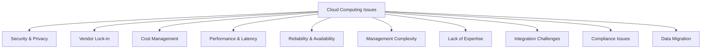
*Figure 37: Common Issues in Cloud Computing*

## Implementing Real-Time Applications

Implementing real-time applications in the cloud presents specific challenges due to the distributed nature of cloud environments and potential network latency. Real-time applications require low latency and high throughput to provide immediate responses to user interactions or incoming data.

**Challenges in the Cloud:**

* **Network Latency:** The inherent latency in transmitting data over the internet or across distributed cloud infrastructure can impact the responsiveness of real-time applications.
* **Jitter:** Variations in network latency can cause inconsistencies in data delivery, affecting the quality of real-time streams (e.g., audio or video).
* **Resource Contention:** In multi-tenant cloud environments, contention for shared resources (CPU, network bandwidth) can lead to unpredictable performance and impact real-time processing.
* **Processing Speed:** Real-time applications often require high-speed data processing, which necessitates careful selection of compute resources and optimization of application code.
* **Data Consistency:** Ensuring data consistency across distributed data stores in real-time can be complex.
* **State Management:** Managing the state of real-time applications across distributed and potentially ephemeral cloud resources requires specific techniques.
* **Scalability:** Real-time applications often experience fluctuating workloads, requiring the cloud infrastructure to scale dynamically and quickly to maintain performance.

**Considerations for Implementation:**

* **Choose the Right Cloud Services:** Select cloud services optimized for low latency and high throughput (e.g., compute instances with high-performance networking, low-latency database options).
* **Geographical Placement:** Deploy application components in cloud regions geographically close to users to minimize network latency. Utilize Content Delivery Networks (CDNs) for delivering static content.
* **Optimize Application Architecture:** Design the application architecture to minimize communication overhead and process data efficiently. Consider using microservices and asynchronous communication.
* **In-Memory Data Stores:** Utilize in-memory databases or caching solutions for fast access to frequently accessed data.
* **Edge Computing:** For applications requiring extremely low latency (e.g., IoT data processing), consider processing data closer to the data source using edge computing.
* **Monitoring and Tuning:** Implement robust monitoring to track performance metrics and identify bottlenecks in real-time. Continuously tune the application and infrastructure for optimal performance.

**Suitable Image/Graph:** A diagram showing the factors affecting the performance of real-time applications in the cloud.

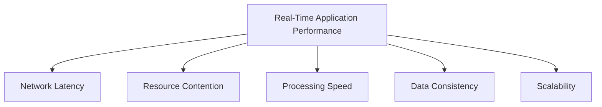
*Figure 38: Factors Affecting Real-Time Application Performance in Cloud*

## QoS Issues in Cloud

Quality of Service (QoS) in cloud computing refers to the ability of a cloud provider to consistently deliver a certain level of performance and reliability for its services, as defined in Service Level Agreements (SLAs). Ensuring adequate QoS is crucial for meeting user expectations and business requirements, especially for mission-critical applications.

**Key QoS Attributes:**

* **Availability:** The percentage of time a service is accessible and operational.
* **Reliability:** The ability of a service to perform its intended function correctly and consistently over time.
* **Performance:** Metrics like response time, throughput, and latency.
* **Scalability:** The ability of the service to handle increasing workloads.
* **Durability:** The ability of storage services to retain data without corruption or loss.
* **Security:** The effectiveness of security measures in protecting data and resources.

**QoS Issues in the Cloud:**

* **Variability in Performance:** Due to the shared nature of cloud resources, performance can sometimes vary depending on the workload of other tenants (the "noisy neighbor" problem).
* **Network Congestion:** Congestion in the internet or the cloud provider's network can impact latency and throughput.
* **Resource Starvation:** Applications may not receive sufficient resources during peak demand if the cloud infrastructure is oversubscribed or resource allocation is not managed effectively.
* **SLA Enforcement:** Ensuring that the cloud provider meets the agreed-upon SLA levels and the process for seeking recourse if SLAs are not met.
* **Monitoring and Measurement:** Accurately monitoring and measuring QoS metrics in a dynamic cloud environment can be challenging.

**Addressing QoS Issues:**

* **Choose Providers with Strong SLAs:** Select cloud providers with clear and comprehensive SLAs that meet your application's requirements.
* **Monitor QoS Metrics:** Implement continuous monitoring to track key QoS metrics and detect deviations from expected levels.
* **Utilize QoS Features:** Leverage cloud provider features like dedicated network connections, guaranteed IOPS for storage, and prioritized compute instances where available and necessary.
* **Design for Resilience:** Build applications with fault tolerance and the ability to degrade gracefully in case of performance degradation or partial outages.
* **Optimize Application Code and Configuration:** Ensure your application is optimized for performance and configured correctly in the cloud environment.

**Suitable Image/Graph:** A diagram showing the key QoS attributes in cloud computing.

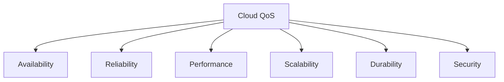
*Figure 39: Key QoS Attributes in Cloud Computing*

## Dependability

Dependability in cloud computing is a broad concept that encompasses the trustworthiness of a system or service. It includes attributes like reliability, availability, maintainability, and resilience, ensuring that the cloud environment performs as expected and can handle failures and disruptions.

**Definition:** The ability of a system to deliver a service that can be justifiably trusted.

**Key Attributes:**

* **Reliability:** The probability that a system will perform its intended function without failure for a specified period under given conditions.
* **Availability:** The probability that a system is operational and accessible when needed. This is often expressed as a percentage (e.g., 99.9% availability).
* **Maintainability:** The ease with which a system can be maintained, repaired, and updated.
* **Resilience:** The ability of a system to withstand and recover from failures, attacks, and other adverse events while continuing to provide an acceptable level of service.
* **Safety:** The absence of catastrophic consequences on the users and the environment.
* **Integrity:** The absence of improper system alteration.

**Dependability in Cloud:**

Cloud providers implement various measures to enhance the dependability of their infrastructure, such as redundant hardware, data replication, automated failover, and geographically distributed data centers. However, achieving end-to-end dependability also requires the cloud consumer to implement appropriate strategies for their applications and data, considering the shared responsibility model.

**Suitable Image/Graph:** A diagram showing the different attributes of dependability.

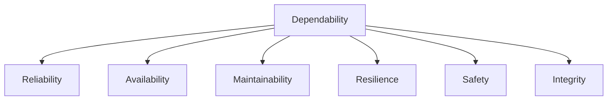
*Figure 40: Attributes of Dependability*

## Data Migration

Data migration is the process of moving data from one storage location or format to another. In cloud computing, this typically involves migrating data from on-premises systems to the cloud, between different cloud storage services, or between different cloud providers. Data migration is often a critical step in cloud adoption and modernization initiatives.

**Complexities:**

* **Data Volume and Variety:** Migrating large volumes of diverse data types can be complex and time-consuming.
* **Data Compatibility and Transformation:** Ensuring that data formats and structures are compatible with the target cloud environment and performing necessary transformations.
* **Downtime and Business Impact:** Minimizing downtime during the migration process to avoid disrupting business operations.
* **Data Security and Integrity:** Ensuring the security and integrity of data during transfer and in the target environment.
* **Network Bandwidth:** Insufficient network bandwidth can significantly slow down the migration process.
* **Complexity of Applications and Dependencies:** Understanding and managing the dependencies between data and applications during migration.
* **Cost:** Data transfer costs and the cost of tools and resources used for migration.

**Strategies:**

* **Online Migration:** Migrating data while applications are still operational, minimizing downtime. This often involves techniques like data replication and synchronization.
* **Offline Migration:** Migrating data while applications are shut down. This is simpler but results in significant downtime.
* **Lift and Shift:** Migrating data and applications as they are, with minimal changes.
* **Refactoring/Re-platforming:** Modifying data structures or using different cloud database services during migration.
* **Phased Migration:** Migrating data in stages based on priority or dependencies.
* **Using Migration Tools and Services:** Leveraging cloud provider migration tools or third-party solutions to automate and simplify the process.
* **Data Cleansing and Validation:** Cleaning and validating data before migration to ensure data quality in the target environment.

**Suitable Image/Graph:** A diagram illustrating the process of data migration from on-premises to the cloud.

```mermaid
graph LR
    A[On-Premises Data Source] --> B[Data Extraction]
    B --> C[Data Transformation/Cleansing]
    C --> D[Data Loading (to Cloud)]
    D --> E[Cloud Data Store]
    E --> F[Cloud Applications]
```
*Figure 41: Data Migration Process to the Cloud*

## Streaming in Cloud

Streaming in the cloud refers to the process of continuously transmitting and processing data as it is generated, rather than processing it in batches. This is essential for applications that require real-time or near real-time insights and responses, such as IoT data processing, log analysis, and financial trading.

**Definition:** Processing data in motion as it arrives, enabling real-time analytics and actions.

**Technologies Used:**

Cloud providers offer managed services and support open-source technologies for building streaming data pipelines:

* **Message Queues and Brokers:** Services like Apache Kafka (often offered as a managed service), Amazon Kinesis, and Azure Event Hubs are used to ingest and buffer high-volume, real-time data streams.
* **Stream Processing Engines:** Frameworks and services like Apache Flink, Apache Spark Streaming, Amazon Kinesis Analytics, and Azure Stream Analytics are used to process and analyze data streams in real-time.
* **Serverless Computing:** Cloud functions (e.g., AWS Lambda, Azure Functions, Google Cloud Functions) can be triggered by incoming data streams to perform real-time processing tasks.
* **NoSQL Databases:** Databases like Amazon DynamoDB, Google Cloud Bigtable, and Apache Cassandra are often used to store and retrieve streaming data due to their ability to handle high write throughput and provide low-latency access.
* **Cloud Storage:** Cloud storage services (e.g., Amazon S3, Google Cloud Storage, Azure Blob Storage) are used for long-term storage of raw or processed streaming data.

**How it Works:**

Data is continuously generated from various sources (e.g., sensors, applications, logs) and ingested into a messaging queue or broker. Stream processing applications consume data from the queue, perform real-time transformations, analysis, or aggregations, and then often store the results in a database or trigger downstream actions.

**Suitable Image/Graph:** A diagram illustrating a typical cloud-based streaming data pipeline.

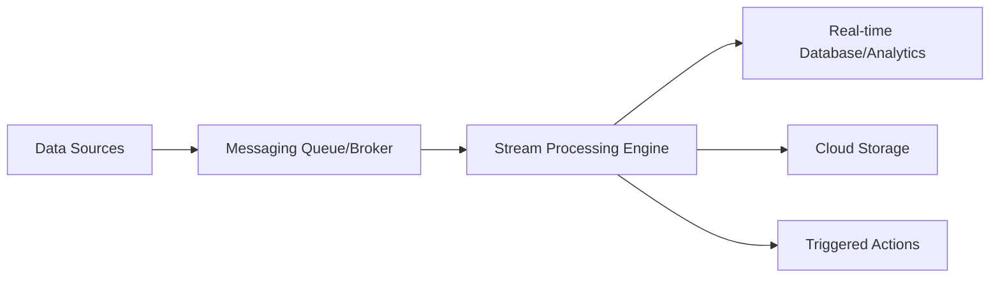
*Figure 42: Cloud Streaming Data Pipeline*

## Cloud Middleware

Cloud middleware is a layer of software that sits between cloud infrastructure and applications, providing a set of services and capabilities that simplify the development, deployment, and management of cloud-based applications. It acts as an intermediary, enabling communication, integration, and orchestration of various cloud resources and services.

**Role and Functions:**

* **Integration:** Facilitating communication and data exchange between different applications, services, and data sources, both within the cloud and between cloud and on-premises environments. This is often achieved through APIs, message queues, and data transformation capabilities.
* **Orchestration and Workflow Management:** Enabling the definition and automation of complex business processes and workflows that span multiple cloud services and applications.
* **API Management:** Providing tools and services for managing the lifecycle of APIs, including security, access control, monitoring, and versioning.
* **Message Brokering:** Providing a reliable and scalable messaging infrastructure for asynchronous communication between decoupled application components.
* **Identity and Access Management (IAM):** Integrating with cloud provider IAM systems to provide centralized authentication and authorization for applications and users.
* **Monitoring and Management:** Providing tools and interfaces for monitoring the performance, availability, and usage of cloud resources and applications.
* **Security:** Implementing security policies and controls at the middleware layer to protect applications and data.
* **Protocol Translation:** Translating between different communication protocols to enable interoperability between diverse systems.

**Benefits:**

Cloud middleware reduces the complexity of building and managing distributed cloud applications, improves agility, enhances scalability, and promotes reusability of services.

**Suitable Image/Graph:** A diagram showing middleware as a layer between cloud infrastructure and applications, facilitating communication and integration.

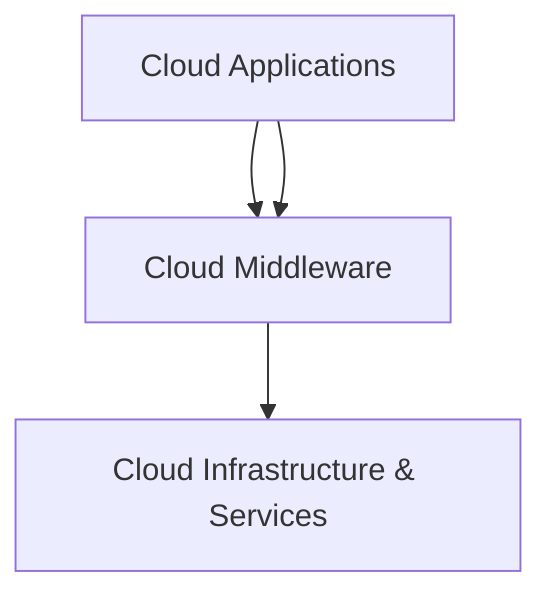
*Figure 43: Role of Cloud Middleware*

## Mobile Cloud Computing

Mobile Cloud Computing (MCC) is a paradigm that combines mobile computing, cloud computing, and wireless networks to provide rich mobile applications for a wide range of mobile devices. In MCC, the data storage and processing are shifted from resource-constrained mobile devices to powerful cloud data centers.

**Architecture:**

A typical MCC architecture involves:

* **Mobile Devices:** Smartphones, tablets, and other mobile devices with limited resources (battery life, processing power, storage).
* **Wireless Networks:** Networks like 3G, 4G, 5G, and Wi-Fi that connect mobile devices to the cloud.
* **Cloud Layer:** Powerful cloud data centers that provide storage, processing, and other services.
* **Middleware Layer (Optional):** Middleware can be used to optimize communication and data exchange between mobile devices and the cloud.
* **Cloudlet Layer (Emerging):** Small-scale data centers located at the edge of the network, closer to mobile devices, to reduce latency for certain applications.

**Challenges:**

* **Network Connectivity and Bandwidth:** Unreliable or limited wireless connectivity and bandwidth can impact the performance and usability of mobile cloud applications.
* **Battery Consumption:** Offloading computation to the cloud can reduce battery consumption on mobile devices, but continuous communication with the cloud can still consume significant power.
* **Security and Privacy:** Ensuring the security and privacy of data transmitted between mobile devices and the cloud, as well as data stored in the cloud.
* **Latency:** Network latency can be a challenge for real-time mobile applications.
* **Context Awareness:** Delivering context-aware mobile cloud services requires collecting and processing context information (e.g., location, user activity) efficiently and securely.
* **Device Heterogeneity:** Developing mobile cloud applications that work seamlessly across a wide range of mobile devices with different operating systems, screen sizes, and capabilities.
* **Vendor Lock-in:** Dependence on specific cloud provider services for mobile backend as a service (MBaaS) or other mobile cloud features.

**Suitable Image/Graph:** A diagram showing the components of Mobile Cloud Computing architecture.

```mermaid
graph TD
    A[Mobile Devices] --> B{Wireless Network}
    B --> C[Cloud Layer]
    C --> D[Cloud Services]
    B --> E[Cloudlet Layer (Optional)]
    E --> D
```
*Figure 44: Mobile Cloud Computing Architecture**

## Inter-Cloud Issues, A Grid of Clouds, Sky Computing

As organizations increasingly use services from multiple cloud providers, challenges arise in managing and integrating these diverse environments. This leads to the concepts of inter-cloud computing, a "grid of clouds," and "Sky computing."

**Inter-Cloud Issues:**

* **Interoperability:** Ensuring that services and data from different cloud providers can work together seamlessly. This requires standardized APIs, data formats, and protocols.
* **Portability:** The ability to easily move applications and data between different cloud providers without significant changes or vendor lock-in.
* **Security:** Maintaining a consistent security posture and ensuring secure communication and data exchange between different clouds.
* **Management:** Managing resources, applications, and users across multiple cloud environments from a single pane of glass.
* **Networking:** Establishing efficient and secure network connectivity between different cloud providers and on-premises data centers.
* **Billing and Cost Management:** Tracking and managing costs across multiple cloud providers.

**A Grid of Clouds:**

This concept envisions a future where multiple cloud providers are interconnected to form a larger, more flexible, and resilient "grid" of computing resources. This would allow users to access and utilize resources from various providers based on their needs, potentially optimizing for cost, performance, or geographical location. It builds upon the concepts of Grid Computing but applied to cloud environments.

**Sky Computing:**

Sky computing is an emerging concept that aims to create a layer of abstraction above multiple cloud providers, allowing users to access and manage resources and services from different clouds through a unified interface or platform. It seeks to address the challenges of inter-cloud computing and vendor lock-in by providing a higher level of abstraction and orchestration across heterogeneous cloud environments. The idea is to make the underlying cloud infrastructure transparent to the user, similar to how the internet abstracts the underlying network infrastructure.

**Suitable Image/Graph:** A diagram illustrating the concept of Sky Computing abstracting resources from multiple underlying clouds.

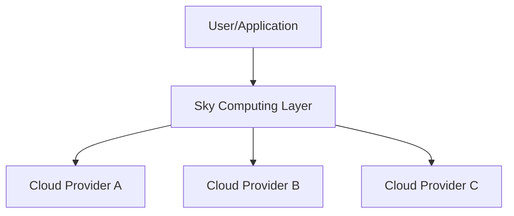
*Figure 45: Sky Computing Concept*

## Load Balancing

Load balancing is a technique used to distribute incoming network traffic or application workloads across multiple servers or resources. In cloud computing, load balancing is essential for ensuring high availability, improving performance, and optimizing resource utilization.

**Definition:** Distributing incoming traffic or workloads across a group of backend resources (e.g., virtual machines, containers) to prevent any single resource from becoming overloaded.

**Importance in Cloud Computing:**

* **High Availability:** If one server fails, the load balancer automatically directs traffic to the remaining healthy servers, ensuring that the application remains available.
* **Improved Performance:** Distributing the workload prevents individual servers from becoming bottlenecks, leading to lower response times and higher throughput.
* **Scalability:** Load balancing enables horizontal scaling by allowing organizations to add more servers to the pool as demand increases, and the load balancer automatically distributes traffic to the new servers.
* **Resource Optimization:** By distributing the load evenly, load balancing helps ensure that all available resources are utilized efficiently.
* **Session Persistence:** Some load balancers can maintain session persistence, directing a user's requests to the same backend server for the duration of their session.

**How it Works:**

A load balancer sits in front of a group of servers. When a request arrives, the load balancer uses a specific algorithm (e.g., Round Robin, Least Connection, IP Hash) to determine which server should handle the request. It then forwards the request to the selected server. Load balancers also perform health checks on the backend servers to ensure they are healthy and capable of handling requests.

**Suitable Image/Graph:** A diagram showing a load balancer distributing traffic to multiple backend servers.

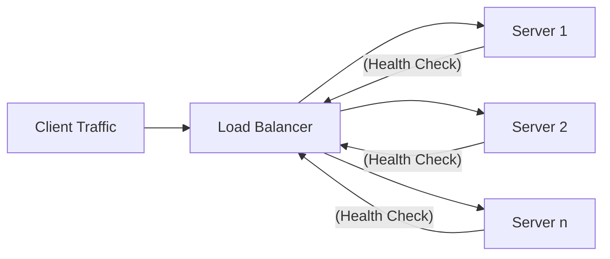
*Figure 46: Cloud Load Balancing*

## Resource Optimization

Resource optimization in cloud computing is the process of efficiently allocating and managing cloud resources to minimize costs, improve performance, and maximize utilization. It involves identifying and eliminating waste while ensuring that applications have the resources they need to function effectively.

**Techniques:**

* **Right-sizing:** Selecting the appropriate size and type of compute instances, storage volumes, and other resources based on application requirements and workload patterns.
* **Auto-scaling:** Automatically adjusting the number of resources (horizontal scaling) or the size of resources (vertical scaling) based on real-time demand.
* **Reserved Instances and Savings Plans:** Committing to a certain level of resource usage in exchange for discounted pricing, suitable for predictable workloads.
* **Spot Instances:** Utilizing unused cloud capacity at significantly discounted prices for fault-tolerant or non-production workloads.
* **Deleting Unused Resources:** Identifying and deleting idle or underutilized resources (e.g., unattached storage volumes, stopped VMs).
* **Serverless Computing:** Using serverless functions or services where the cloud provider automatically manages resource allocation and scaling based on demand, and you only pay for the actual execution time.
* **Storage Optimization:** Choosing the right type of storage for different data access patterns and using data lifecycle policies to move data to lower-cost storage tiers over time.
* **Cost Monitoring and Analysis:** Continuously monitoring cloud spending, analyzing cost data, and identifying areas for optimization.
* **Automation:** Automating resource provisioning, scaling, and de-provisioning to ensure efficient resource utilization.
* **Rightsizing Databases:** Optimizing database performance and costs by selecting the appropriate database instance size, storage, and configuration.

**Suitable Image/Graph:** A diagram showing how rightsizing and auto-scaling contribute to resource optimization.

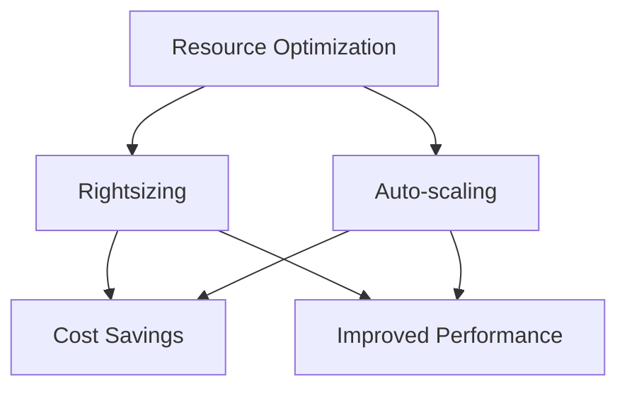
*Figure 47: Cloud Resource Optimization Concepts*

## Resource Dynamic Reconfiguration

Resource dynamic reconfiguration in cloud computing refers to the ability to modify the configuration of cloud resources (e.g., virtual machines, storage, network) while they are running, without requiring a full system restart or significant downtime. This is a key aspect of cloud elasticity and enables greater flexibility and responsiveness to changing demands.

**Definition:** Modifying the attributes or allocation of cloud resources on the fly.

**Examples of Dynamic Reconfiguration:**

* **Vertical Scaling (Scale Up/Down):** Increasing or decreasing the CPU, memory, or storage allocated to a virtual machine without stopping and restarting the VM (if supported by the cloud provider and instance type).
* **Adjusting Storage Performance:** Modifying the IOPS (Input/Output Operations Per Second) or throughput of a storage volume dynamically.
* **Modifying Network Bandwidth:** Adjusting the network bandwidth allocated to a virtual machine.
* **Changing Security Group Rules:** Dynamically updating firewall rules to allow or deny traffic to and from resources.
* **Attaching/Detaching Storage Volumes:** Attaching or detaching storage volumes from a running VM.

**Benefits:**

* **Increased Agility:** Respond quickly to changes in workload demands or application requirements.
* **Reduced Downtime:** Avoid the need for planned downtime to reconfigure resources.
* **Improved Performance:** Optimize resource allocation in real-time to maintain application performance.
* **Cost Savings:** Scale down resources during periods of low demand to reduce costs.

**Considerations:**

Not all cloud resources and configurations can be dynamically reconfigured; the extent of dynamic reconfiguration capabilities depends on the cloud provider and the specific service. Careful planning and testing are required to ensure that dynamic reconfiguration does not negatively impact application stability.

**Suitable Image/Graph:** A simple diagram showing a running VM and the ability to dynamically adjust its resources.

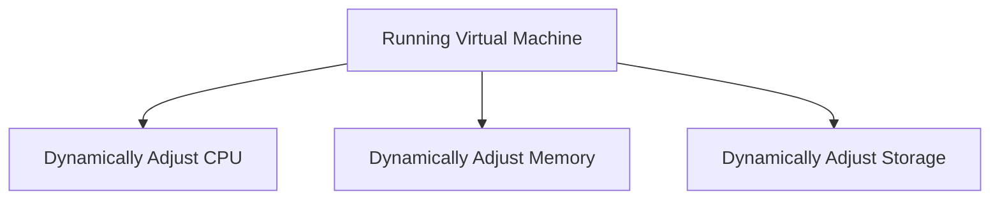
*Figure 48: Dynamic Resource Reconfiguration*

## Monitoring in Cloud

Monitoring in the cloud is the continuous process of collecting, analyzing, and responding to data and metrics related to the performance, health, and security of cloud resources, applications, and services. It is essential for ensuring the reliability, availability, and performance of cloud deployments, as well as for identifying and mitigating security threats and optimizing costs.

**Importance:**

* **Performance Management:** Identify performance bottlenecks and optimize resource allocation.
* **Availability Management:** Detect outages and service disruptions and facilitate quick recovery.
* **Security Monitoring:** Detect suspicious activity, security threats, and policy violations.
* **Cost Management:** Track resource usage and identify areas for cost optimization.
* **Capacity Planning:** Understand resource utilization trends for future capacity planning.
* **Troubleshooting:** Diagnose and resolve issues quickly.
* **Compliance:** Collect audit logs and demonstrate compliance with regulations.

**Methods:**

* **Metrics Collection:** Gathering quantitative data about resource usage (CPU, memory, network I/O, storage), application performance (response time, error rates), and system health.
* **Log Collection and Analysis:** Collecting logs from operating systems, applications, and cloud services and analyzing them to gain insights into system behavior and identify errors or security events.
* **Distributed Tracing:** Tracking requests as they propagate through distributed cloud-native applications to identify performance bottlenecks and errors.
* **Synthetics and Uptime Monitoring:** Actively testing the availability and performance of applications and services from outside the environment.
* **Alerting and Notifications:** Setting up alerts based on pre-defined thresholds or anomalies in metrics and logs to notify administrators of potential issues.
* **Dashboards and Visualization:** Creating visual representations of monitoring data to provide a clear overview of the cloud environment's health and performance.
* **Automated Remediation:** Implementing automated actions to respond to certain alerts (e.g., automatically scaling resources up or down).

Cloud providers offer comprehensive monitoring services, and there are also many third-party monitoring tools available that integrate with cloud platforms.

**Suitable Image/Graph:** A diagram showing a monitoring platform collecting data from various cloud resources and providing dashboards and alerts.

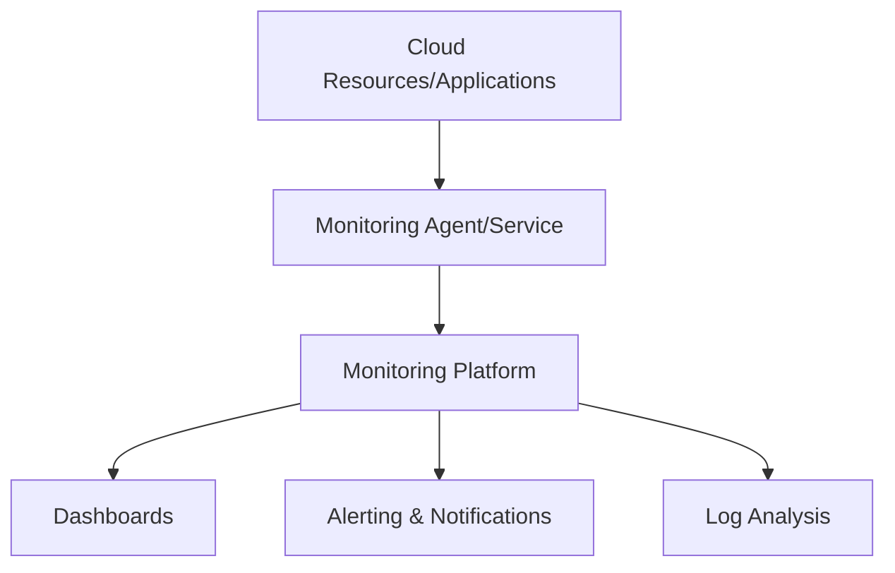
*Figure 49: Cloud Monitoring Process*

## Installing Cloud Platforms and Performance Evaluation

Installing cloud platforms typically refers to setting up and configuring private cloud environments or on-premises cloud software. Performance evaluation involves assessing the performance of cloud resources, applications, and the overall cloud infrastructure.

**Installing Cloud Platforms (Private/On-Premises):**

* **Choosing the Right Software:** Selecting an open-source (e.g., OpenStack) or commercial cloud platform software.
* **Hardware Requirements:** Provisioning the necessary compute, storage, and networking hardware.
* **Installation and Configuration:** Installing and configuring the cloud platform software, including the management components, compute nodes, storage nodes, and networking.
* **Integration with Existing Infrastructure:** Integrating the cloud platform with existing data centers, networks, and management systems.
* **Testing and Validation:** Thoroughly testing the installed platform to ensure it is functioning correctly and meets performance and scalability requirements.
* **Security Configuration:** Configuring security controls within the cloud platform.

**Performance Evaluation:**

Performance evaluation in cloud computing is crucial for understanding the capabilities of the chosen cloud environment, optimizing application performance, and ensuring that the environment meets performance SLAs.

* **Benchmarking:** Using standardized tests to measure the performance of cloud resources (e.g., CPU, storage I/O, network throughput) under different conditions.
* **Load Testing:** Testing the performance of applications and the cloud infrastructure under expected and peak load conditions.
* **Stress Testing:** Pushing the system beyond its normal operating capacity to identify breaking points and observe how it behaves under extreme load.
* **Soak Testing:** Testing the system under a sustained load over an extended period to identify performance degradation or resource leaks.
* **Monitoring and Analysis:** Using monitoring tools to collect performance metrics during testing and analyzing the data to identify bottlenecks and areas for optimization.
* **Application Profiling:** Analyzing the performance of specific applications to identify code-level bottlenecks.
* **Comparison:** Comparing the performance of different cloud instance types, storage options, or configurations.

**Suitable Image/Graph:** A diagram showing the process of installing a private cloud platform or a flowchart of the performance evaluation process. Let's illustrate the performance evaluation steps.

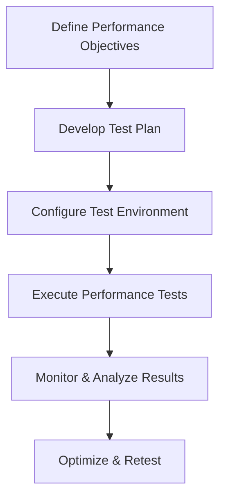
*Figure 50: Cloud Performance Evaluation Process*

## Features and Functions of Cloud Computing Platforms

Cloud computing platforms (offered by CSPs like AWS, Azure, Google Cloud, etc.) provide a wide range of features and functions that enable users to build, deploy, and manage applications and services in the cloud.

**Key Features and Functions:**

* **Compute Services:**
    * **Virtual Machines (VMs):** On-demand, scalable virtual servers.
    * **Containers:** Services for running and managing containerized applications (e.g., Kubernetes services).
    * **Serverless Computing:** Running code without provisioning or managing servers (e.g., functions,
* **Storage Services:**
    * **Object Storage:** Scalable, durable storage for unstructured data (e.g., S3, Azure Blob Storage, Google Cloud Storage).
    * **Block Storage:** High-performance storage volumes for VMs (e.g., EBS, Azure Disk Storage, Google Persistent Disk).
    * **File Storage:** Shared file systems (e.g., EFS, Azure Files, Google Filestore).
* **Database Services:**
    * **Managed Relational Databases:** (e.g., RDS, Azure Database, Cloud SQL).
    * **Managed NoSQL Databases:** (e.g., DynamoDB, Cosmos DB, Bigtable, Datastore).
    * **Data Warehousing:** (e.g., Redshift, Azure Synapse Analytics, BigQuery).
* **Networking Services:**
    * **Virtual Networks:** Creating isolated networks in the cloud (e.g., VPC, Azure VNet, Google Cloud VPC).
    * **Load Balancing:** Distributing traffic across resources.
    * **DNS Services:** Domain Name System resolution.
    * **Content Delivery Networks (CDNs):** Caching and delivering content closer to users.
* **Identity and Access Management (IAM):** Managing user identities, authentication, and authorization.
* **Security Services:** Firewalls, security groups, encryption, key management, threat detection.
* **Management and Monitoring Tools:** Dashboards, logging, alerting, automation.
* **Developer Tools:** CI/CD pipelines, code repositories, development environments.
* **Big Data and Analytics Services:** Services for processing and analyzing large datasets (e.g., EMR, HDInsight, Dataproc, data lakes, analytics platforms).
* **Artificial Intelligence and Machine Learning Services:** Pre-trained models, machine learning platforms.

These features and functions are typically exposed through web-based management consoles, APIs, and command-line interfaces, allowing users to provision, configure, and manage their cloud resources programmatically.

**Suitable Image/Graph:** A diagram showing the different categories of services offered by a cloud computing platform.

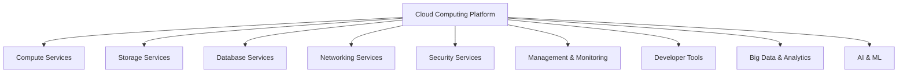
*Figure 51: Categories of Cloud Computing Platform Features*
